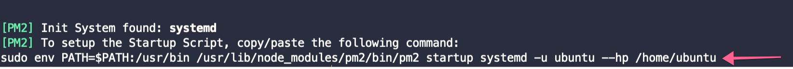

# AWS (Amazon Web Service)

***This tutorial only works on a VPS server that is running ubuntu 18.04 - 20.10.***

***Please follow this video with the documentation, and it'll the installation process relatively easy.***

<iframe width="860" height="530" src="https://www.youtube.com/embed/SGjIHIhnWws" frameborder="0" allow="accelerometer; autoplay; clipboard-write; encrypted-media; gyroscope; picture-in-picture" allowfullscreen></iframe>

## How to create ec2 server?

In this AWS tutorial, we're going to create an ec2 server. To do that at first, login to your AWS account and then click,

```
ec2 -> Instance -> Launch Instance
```


Then select a ubuntu 20.04 server

After that, click `Next` -> `Next` -> `Next` -> `Next`

And on security pages, add a rule for `HTTP`,


After review, click `Launch,` and you'll get and popup for KeyPair, which will be required to login to the server using ssh.

If you already have a previous KeyPair, you can use that; otherwise, you can create a new one. After completing that, make sure you download that KeyPair.


After launching the instance, you'll get the server IP, which will be required to login into ssh.


## Domain Setup

Our server setup is done; now, we're going to set up the domain.

For domain and DNS, we're going to use `Cloudflare.` It's a free DNS service that is used for DNS management and CDN. Not only that, it can be used to improve the security of your website as all the network come throw your website by Cloudflare, and Cloudflare can prevent most of the security threats based on their traffic filtering.

To use Cloudflare,

1. Create a Cloudflare account

2. Add a site
3. Input your domain name
4. And change the nameserver to your domain provider admin panel.


Now we'll be connecting our created AWS server with Cloudflare.

To do that, copy the `IP Address` from the `AWS` panel and then add it to `Cloudflare` as an `A` record.


Then add and another `CNAME` record for `www`


We successfully create our server and domain. Now we're going to set up the server to host the `pickbazar.`

### Admin -> Subdomain

At first, we've to create a subdomain from `Cloudflare`. To do that, at first go to `Cloudflare` DNS management section and add `store` subdomain `CNAME` record.


## Login to Server

At first, login to your `AWS` server using ssh. to do that, go to the folder from the terminal where `KeyPair` is downloaded.

then click `Connect`


From the `Connect` dashboard, go to `SSH Client` and copy the example line and paste it to your terminal.


With this command, you will successfully connect to your server throw ssh.

### Change permission .pem
You've to change the permission downloaded `.pem` file to `400` to access the server. To do that, at first go to the location where .pem store then run,

```bash
chmod 400 pickbazar.pem
```

Change the `pickbazar.pem` filename if you use a different name during generate the key.

## Install NodeJS & Required Application

### Install NodeJS
At first, we've to install NodeJS and npm to run the pickbazar app. To install NodeJS and npm, run this command on your server terminal,

```bash
sudo apt-get update
```

```bash
curl -sL https://deb.nodesource.com/setup_14.x | sudo -E bash -
```

```bash
sudo apt-get install -y nodejs
```

### Install Yarn
As pickbazar is highly dependent on `yarn`, it would be best to handle all the script parts using `yarn`. So to install yarn, use this command,

```bash
sudo npm i -g yarn
```
If you face any permission issue, then please check this official doc to resolve that,

[Npm Permission Issue](https://docs.npmjs.com/resolving-eacces-permissions-errors-when-installing-packages-globally)

### Install Zip & Unzip
```bash
sudo apt install zip unzip
```

### Install PM2
Now we will install PM2, which is a process manager for Node.js applications. PM2 provides an easy way to manage and daemonize applications (run them in the background as a service). To install pm2 use this command,

```bash
sudo npm install -g pm2
```

After restarting the server or if the server crash, then pm2 will halt the process. To prevent that, we'll add pm2 as a `startup` process to run automatically after restart the server.

```bash
pm2 startup systemd
```

After running this command, you'll get and command which you've to run on the terminal again,



## Install Nginx

### Introduction

Nginx is one of the most popular web servers in the world. In this deployment tutorial, we're going to use Nginx to host our website. In this tutorial, we're going to use ubuntu 20.04 to host pickbazar


### Step 1 - Installing Nginx

After creating the server, make sure the apt library is up to date. To update the apt library, use this command,

```bash
sudo apt update
```

After the update apt, we're going to install Nginx. To do that, use this command

```bash
sudo apt install nginx
```

### Step 2: Adjusting the Firewall

Before testing Nginx, the firewall software needs to be adjusted to allow access to the service. Nginx registers itself as a service with `ufw` upon installation, making it straightforward to allow Nginx access.

To check the `ufw` list, use this command,

```bash
sudo ufw app list
```

You will get a listing of an application list like this,


At first, add ssh to the firewall,

```bash
sudo ufw allow ssh
```

After that, to enable Nginx on the firewall, use this command,

```bash
sudo ufw allow 'Nginx HTTP'
```

Now enable the firewall,

```bash
sudo ufw enable
```

```bash
sudo ufw default deny
```

You can verify the change by typing:

```bash
sudo ufw status
```

The output will be indicated which HTTP traffic is allowed:


### Step 3 – Checking your Web Server

Now check the status of the Nginx web server by using this command,

```
systemctl status nginx
```

Now, if you go to your server IP address, then you'll get web site similar to this image,


As we're going to deploy API, admin, and shop on the same server, we've created three other subdomains.

### Step 4: Setting Up Server & Project

In this chapter, we'll set up our server and also will setup Reverse Proxy to host all of our sites from the same server.

#### Reverse Proxy Setup

We've to set up a reverse proxy for the NodeJS app to deliver the API from the same domain but with a different domain. To do that edit,

```
sudo nano /etc/nginx/sites-enabled/default
```

Within the server block, you should have an existing location/block remove that block first and then Paste this on the deleted location block,

```nginx
location /{
        proxy_pass http://localhost:3000;
        proxy_http_version 1.1;
        proxy_set_header Upgrade $http_upgrade;
        proxy_set_header Connection 'upgrade';
        proxy_set_header Host $host;
        proxy_cache_bypass $http_upgrade;
}
```

```nginx
location /shop/graphql{
        proxy_pass http://localhost:4000/shop/graphql;
        proxy_http_version 1.1;
        proxy_set_header Upgrade $http_upgrade;
        proxy_set_header Connection 'upgrade';
        proxy_set_header Host $host;
        proxy_cache_bypass $http_upgrade;
}
```


Similarly for Admin API add another server block after parent block,

```nginx
server {
        listen 80;
        listen [::]:80;

        root /var/www/html;
        index index.html index.htm index.nginx-debian.html;

        server_name admin.your_domain.com;

        location /{
                proxy_pass http://localhost:5000;
                proxy_http_version 1.1;
                proxy_set_header Upgrade $http_upgrade;
                proxy_set_header Connection 'upgrade';
                proxy_set_header Host $host;
                proxy_cache_bypass $http_upgrade;
        }

        location /admin/graphql{
                proxy_pass http://localhost:7000/admin/graphql;
                proxy_http_version 1.1;
                proxy_set_header Upgrade $http_upgrade;
                proxy_set_header Connection 'upgrade';
                proxy_set_header Host $host;
                proxy_cache_bypass $http_upgrade;
        }
}
```


Save and close the file by typing `CTRL` and `X,` then `Y` and `ENTER` when you are finished.


Make sure you didn’t introduce any syntax errors by typing:

```bash
sudo nginx -t
```

Next, restart Nginx:

```bash
sudo systemctl restart nginx
 ```

## Project Build
Typescript requires a huge chunk of memory to build the project, so if your server has at least 4gb+ of memory, then you can build the project on your server directly. If not, then build the project on your server, then move the folder to the server then serve the project. We'll do the second method in this tutorial.

### Download the project

At first, download the `pickbazar` from the ThemeForest. after that, extract the folder, and on that folder, you'll get a folder called `pickbazar`. Open your terminal and go to that `pickbazar` folder.

### Install & Build
To install all the npm packages run this command,

```bash
yarn
```

### Build the project

At first, we've to copy the sample `env` to production `.env` for the shop. To do that go to,

```bash
cd packages/shop
```

then use this command to copy,

```bash
cp .env.local.sample .env
```

As `nextjs` require an API server running to build the frontend, you can use our endpoint to build the project to do that, edit `.env` and change `NEXT_PUBLIC_GRAPHQL_API_ENDPOINT` to `https://pickbazar-api.now.sh/shop/graphql`

```bash
nano .env
```
and use
```bash
NEXT_PUBLIC_GRAPHQL_API_ENDPOINT=https://pickbazar-api.now.sh/shop/graphql
```

After that, go to the root `pickbazar` folder again,

```bash
cd ../../
```

and run,

```bash
yarn build:shop
```

And for admin, go to,

```bash
cd packages/admin
```

edit `.env`

```bash
nano .env
```

and change `REACT_APP_API_URL` to,

```bash
http://admin.YOUR_DOMAIN.com/admin/graphql
```
After that, go to the root pickbazar folder again,

```bash
cd ../../
```

```bash
yarn build:admin
```

Then go to shop `env` again,

```bash
cd packages/shop
```

Edit `.env`

```bash
nano .env
```

and change `NEXT_PUBLIC_GRAPHQL_API_ENDPOINT` to,

```
http://YOUR_DOMAIN.com/shop/graphql
```

also add `NEXT_PUBLIC_STRIPE_PUBLIC_KEY`

Now again, go to the root folder of `pickbazar`

```bash
cd ../../
```

As we used the same server to host our admin and shop API, we will change the port for admin to conflict with shop API. If you use a different server for another API host, you can skip this PORT part.

Go to,

```bash
cd packages/api
```

Then edit `server.admin.ts`

and change the port


Now again, go to the root folder of `pickbazar`

```bash
cd ../../
```

and for build API, run,


```bash
yarn build:api
```

and delete the `node_modules` folder. and go to the downloaded root folder and zip `pickbazar` folder


### Permission

Go to the `server` ssh and provide appropriate ownership for that folder,

```bash
sudo chown -R $USER:$USER /var/www/html
```

Then, provide permission for that folder,

```bash
sudo chmod -R 755 /var/www/html
```

### Copy Project to the Server

Login to the server with an SFTP client; during the login, the host will be the server's IP address, and the `username` will be `ubuntu,` and the `password` will be `blank.` Make sure you provide the remote path to,

```
/var/www/html
```

Then copy the zip pickbazar to

```
/var/www/html
```

### Unzip the Project

Login to the ssh server again and go to,

```bash
cd /var/www/html
```

then unzip `pickbazar` folder,

```bash
unzip pickbazar.zip
```

## Install And Run
And finally, we'll be going to build all the apps and run all of them. To do that go to,

```
cd /var/www/html/pickbazar
```

To install all the node packages,
```bash
yarn
```

Then to run the admin app, use this command,

```bash
pm2 --name admin start yarn -- run serve:admin
```

And for shop app, use this command,

```bash
pm2 --name shop start yarn -- run serve:shop
```

#### NB: For others, servers like azure or digital ocean processes will be the same. After creating the server, follow this tutorial from `Install NodeJS & Required Application.`

## References:

Please check this article to understand the deployment part fully.

- https://www.digitalocean.com/community/tutorials/-how-to-install-nginx-on-ubuntu-20-04
- https://www.digitalocean.com/community/tutorials/how-to-set-up-a-node-js-application-for-production-on-ubuntu-16-04
- https://nicknetvideos.com/blog/post/how-to-run-a-website-in-a-subdomain-in-digital-ocean
- https://www.digitalocean.com/community/tutorials/how-to-secure-nginx-with-let-s-encrypt-on-ubuntu-20-04