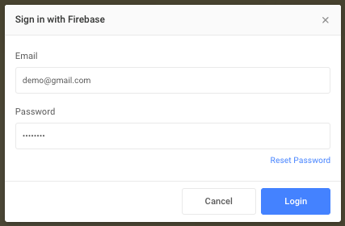
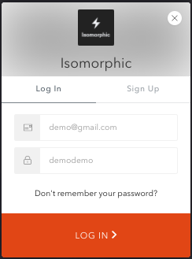

# Authentication

We provided two third party Auth integration in our Project. There are
1. Firebase
2. Auth0

A brief description about them is given bellow.

## Firebase

Firebase-Doc

```
Folder path: /src/components/firebase/
```

If you want a login button like the following image given bellow.


On the `onclick` function of the button You can render a form with two input fields(one for Email and one for Password). And passing those credentials through the Firebase Api, a user can be get signed up or singed in. The following code is connects the User inputs to the Firebase Api

`Firebase.login(Firebase.EMAIL, { email, password })`


And you can use basic Javascript promise methods like then() or catch() methods and use the Firebase returned data to do your desired operations like the following code

```js
Firebase.login(Firebase.EMAIL, { email, password })
      .then(result => {
        // Do something
      })
      .catch(error => {
        // Handle your error precisely
      })
```

To Use the Firebase Api you need to configure your app to the [FIrebase Official Website](https://firebase.google.com/docs/auth/web/password-auth) first. And put your app credentials to the config file of our app.

Path to the config file: `/src/config.js`

The following are the important Credentials you must provide in order to make Firebase Authentication work.

The following are the important Credentials you must provide in order to make Firebase Authentication work.

** Keys **
- apiKey
- authDomain
- databaseURL
- projectId
- storageBucket
- messagingSenderId

Currently We are providing Firebase authentication through Email and password only. You can also integrate Social Logins (Facebook, Google, Github, Twitter) with Firebase. The code will be found on the following Path: `Folder path: /src/helpers/firebase/`

And the code is like the following.

| Authentication Type      | Helper function | 	Manual Code |
| ----------- | ----------- | ----------- |
| Basic(Email, Password)      | firebaseAuth().signInWithEmailAndPassword()       | 	Firebase.login(Firebase.EMAIL, { email, password })       |
| Facebook      | firebaseAuth().FacebookAuthProvider()       | 	Firebase.login(Firebase.FACEBOOK)       |
| Google      | firebaseAuth().GoogleAuthProvider()       | Firebase.login(Firebase.GOOGLE)       |
| Github      | firebaseAuth().GithubAuthProvider()       | 	Firebase.login(Firebase.GITHUB)       |
| Twitter      | 	firebaseAuth().TwitterAuthProvider()       | Firebase.login(Firebase.TWITTER)       |

After all those Works clicking the Login with Firebase button A prompt Window like the following will open




## Auth0

[Auth0-official-website](https://auth0.com/)

```
Folder path: /src/helpers/auth0/
```

If you want a login button like the following image given bellow.


Just need to Place a button and On the onclick function of the button You can render the following functions provided by Auth0 itself.


| Function      | Details |
| ----------- | ----------- |
| new Auth0Lock()      | Instantiating Lock       |
| getUserInfo()      | Obtaining the profile of a logged in user       |
| show()      | 	Showing the lock widget       |
| on()      | 	Listening for events       |
| logout()      | Log out the user       |

We are using the firebase [Lock](https://auth0.com/lock) widget.

In the folder path `/src/helpers/auth0/` there is a Auth0Helper class that uses all the functions.

To Use the Firebase Api you need to configure your app to the Auth0-Official documentation first. And put your app credentials to the config file of our app.

Path to the config file: `src/settings/index.js`

The following are the important Credentials you must provide in order to make Firebase Authentication work.

**Keys**
- clientID
- domain

After all those Works clicking the Login with Auth0 button A prompt Window like the following will open

