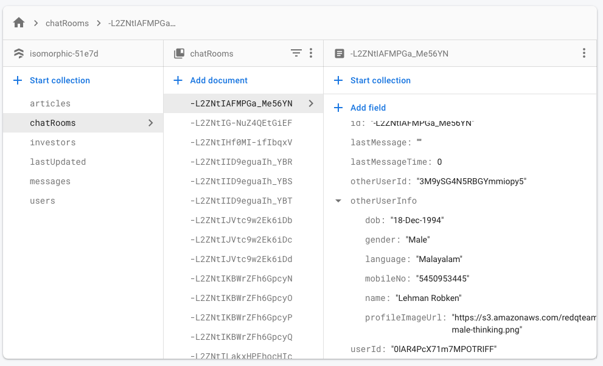
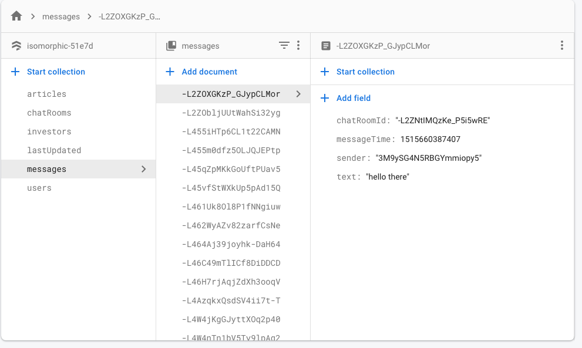
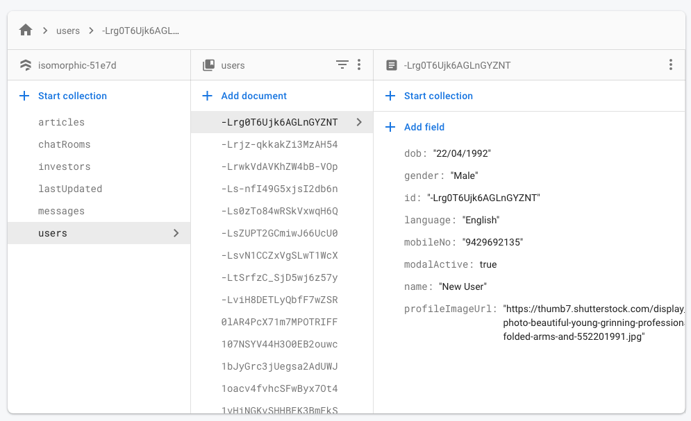

# Chat Firebase

`Folder path: /src/containers/Chat`

If you want to render Chat component for different Views

### Desktop View

Folder path: /src/containers/Chat/destopView.js

### Tab and Mobile View

Folder path: `/src/containers/Chat/mobileView.js`

Major Components

|Component|Description|
|--- |--- |
|Chatroom|list of chats|
|Messeges|list of messages of single chatroom|
|ComposeMessage|to compose message|
|ViewProfile|to view sender and receiver profil|
|ComposeMessage|to compose message|

### Firebase Credential
To Use the Firebase Api you need to configure your app to the FIrebase Official Website first. And put your app credentials to the config file of our app.

Path to the config file: `/src/settings/inde.js`

The following are the important Credentials you must provide in order to make Firebase Authentication work.

|Keys|
|--- |
|apiKey|
|authDomain|
|databaseURL|
|projectId|
|storageBucket|
|messagingSenderId|


### firebase data structure

```js
{
  users: [
    {
      key: 'wt4TiasxgPrQ3dNwVZ55',
      data: {
        dob: '06-Apr-1993',
        gender: 'Male',
        language: 'Burmese',
        mobileNo: '5726784596',
        name: 'Zondra Kulic',
        profileImageUrl: 'https://s3.amazonaws.com/redqteam.com/mateadmin/support-male-zonra.png'
      },
    },
    ...
  ],
  chatRooms: [
    {
      key: '-L2ZNtIAFMPGa_Me56YN',
      data: {
        id: '-L2ZNtIAFMPGa_Me56YN',
        lastMessage: '',
        lastMessageTime: 0,
        otherUserId: '3M9ySG4N5RBGYmmiopy5',
        userId: '0lAR4PcX71m7MPOTRIFF'
      }
    },
    ...
  ],
  messages: [
    {
      key: '-L2ZOXGKzP_GJypCLMor',
      data: {
        chatRoomId: '-L2ZNtIMQzKe_P5i5wRE',
        messageTime: 1515660387407,
        sender: '3M9ySG4N5RBGYmmiopy5',
        text: 'hello there'
      }
    },
    ...
  ]
}
```

You need to create some users, chatrooms, messages if you want to check how firebase chat works in isomorphic, check the data format in the below snaps,

### Chatrooms:


### Messages:


### Users:



