# Form Elements

## Input Form:

### Basic Form:

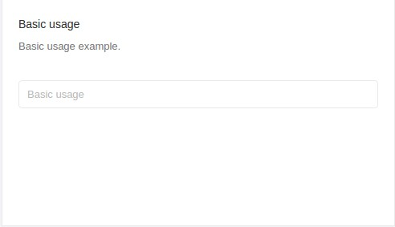

#### Code:

```jsx
<Col md={12} sm={12} xs={24} style={colStyle}>
  <Box title="Basic usage" subtitle="Basic usage example.">
    <ContentHolder>
      <Input placeholder="Basic usage" />
    </ContentHolder>
  </Box>
</Col>
```

File Path: `your-dash-app-root/src/containers/Forms/Input/index.js`

### Form with Different Size:

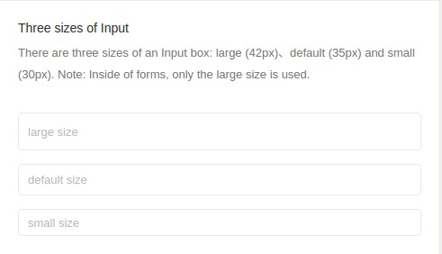

#### Code:

```jsx
<Col md={12} sm={12} xs={24} style={colStyle}>
  <Box
    title="Three sizes of Input"
    subtitle="There are three sizes of an Input box: large (42px)、default (35px) and small (30px). Note: Inside of forms, only the large size is used."
  >
    <ContentHolder>
      <Input
        size="large"
        placeholder="large size"
        style={{ marginBottom: '15px' }}
      />
      <Input
        placeholder="default size"
        style={{ marginBottom: '15px' }}
      />
      <Input size="small" placeholder="small size" />
    </ContentHolder>
  </Box>
</Col>
```

File Path: `your-dash-app-root/src/containers/Forms/Input/index.js`

### Input Group:

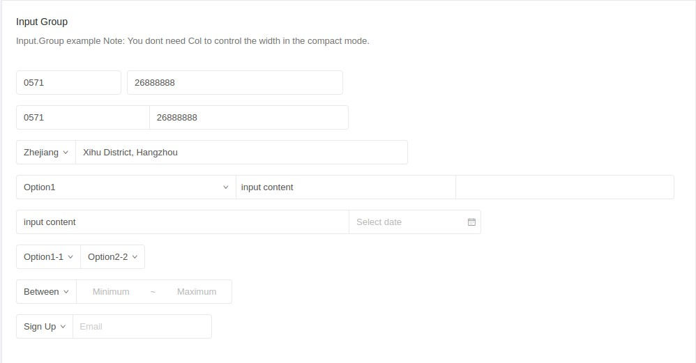

#### Code:

```jsx

            defaultValue="Xihu District, Hangzhou"
          />
        </InputGroup>

        <InputGroup compact style={{ marginBottom: '15px' }}>
          <Select defaultValue="Option1" style={{ width: '33%' }}>
            <Option value="Option1">Option1</Option>
            <Option value="Option2">Option2</Option>
          </Select>
          <Input
            style={{ width: '33%' }}
            defaultValue="input content"
          />
          <InputNumber style={{ width: '33%' }} />
        </InputGroup>

        <InputGroup compact style={{ marginBottom: '15px' }}>
          <Input
            style={{ width: '50%' }}
            defaultValue="input content"
          />
          <DatePicker />
        </InputGroup>

        <InputGroup compact style={{ marginBottom: '15px' }}>
          <Select defaultValue="Option1-1">
            <Option value="Option1-1">Option1-1</Option>
            <Option value="Option1-2">Option1-2</Option>
          </Select>
          <Select defaultValue="Option2-2">
            <Option value="Option2-1">Option2-1</Option>
            <Option value="Option2-2">Option2-2</Option>
          </Select>
        </InputGroup>

        <InputGroup compact style={{ marginBottom: '15px' }}>
          <Select defaultValue="1">
            <Option value="1">Between</Option>
            <Option value="2">Except</Option>
          </Select>
          <Input
            style={{ width: 100, textAlign: 'center' }}
            placeholder="Minimum"
          />
          <Input
            style={{ width: 24, borderLeft: 0, pointerEvents: 'none' }}
            placeholder="~"
          />
          <Input
            style={{ width: 100, textAlign: 'center', borderLeft: 0 }}
            placeholder="Maximum"
          />
        </InputGroup>

        <InputGroup compact style={{ marginBottom: '15px' }}>
          <Select defaultValue="Sign Up">
            <Option value="Sign Up">Sign Up</Option>
            <Option value="Sign In">Sign In</Option>
          </Select>
          <AutoComplete
            dataSource={this.state.dataSource}
            style={{ width: 200 }}
            onChange={this.handleChange}
            placeholder="Email"
          />
        </InputGroup>
      </ContentHolder>
    </Box>
  </Col>
```

### Autosizing the height to fit the content:
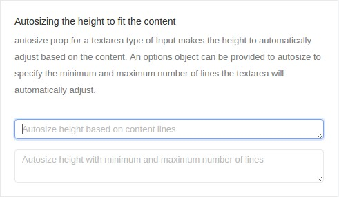

#### Code:

```jsx
<Col md={12} sm={12} xs={24} style={colStyle}>
  <Box
    title="Autosizing the height to fit the content"
    subtitle="autosize prop for a textarea type of Input makes the height to automatically adjust based on the content. An options object can be provided to autosize to specify the minimum and maximum number of lines the textarea will automatically adjust."
  >
    <ContentHolder>
      <Input
        type="textarea"
        placeholder="Autosize height based on content lines"
        autosize
        style={{ marginBottom: '15px' }}
      />
      <Input
        type="textarea"
        placeholder="Autosize height with minimum and maximum number of lines"
        autosize={{ minRows: 2, maxRows: 6 }}
      />
    </ContentHolder>
  </Box>
</Col>
```

File Path: `your-dash-app-root/src/containers/Forms/Input/index.js`

### Pre / Post tab:
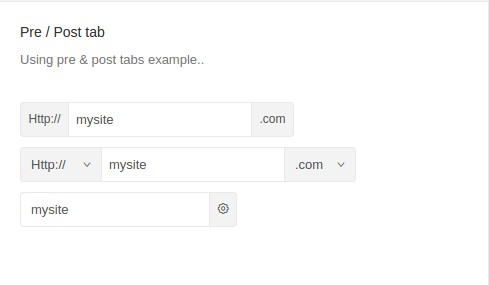

### Code

```jsx
<Col md={12} sm={12} xs={24} style={colStyle}>
  <Box
    title="Pre / Post tab"
    subtitle="Using pre &amp; post tabs example.."
  >
    <ContentHolder>
      <Input
        addonBefore="Http://"
        addonAfter=".com"
        defaultValue="mysite"
      />
      <Input
        addonBefore={selectBefore}
        addonAfter={selectAfter}
        defaultValue="mysite"
      />
      <Input
        addonAfter={<Icon type="setting" />}
        defaultValue="mysite"
      />
    </ContentHolder>
  </Box>
```

File Path: `your-dash-app-root/src/containers/Forms/Input/index.js`

### Search:
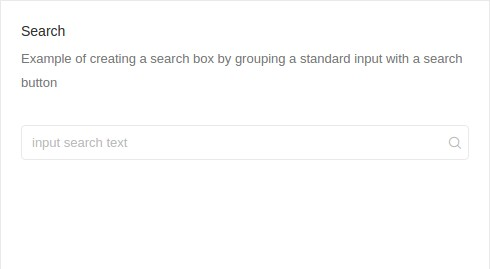

#### Code:

```jsx
<Col md={12} sm={12} xs={24} style={colStyle}>
  <Box
    title="Search"
    subtitle="Example of creating a search box by grouping a standard input with a search button"
  >
    <ContentHolder>
      <Search placeholder="input search text" />
    </ContentHolder>
  </Box>
</Col>
```

File Path: `your-dash-app-root/src/containers/Forms/Input/index.js`

### Editor:
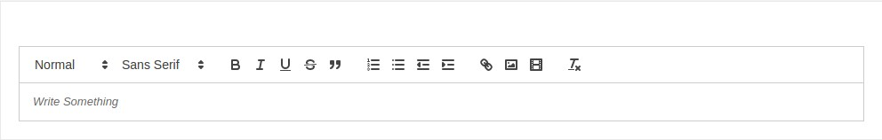

#### Code:
```jsx
const Editor = (props) => <Async load={import(/* webpackChunkName: "forms-editor" */ '../../../components/uielements/editor')} componentProps={props} />;

function uploadCallback(file) {
  return new Promise(
    (resolve, reject) => {
      const xhr = new XMLHttpRequest();
      xhr.open('POST', 'https://api.imgur.com/3/image');
      xhr.setRequestHeader('Authorization', 'Client-ID 8d26ccd12712fca');
      const data = new FormData();
      data.append('image', file);
      xhr.send(data);
      xhr.addEventListener('load', () => {
        const response = JSON.parse(xhr.responseText);
        resolve(response);
      });
      xhr.addEventListener('error', () => {
        const error = JSON.parse(xhr.responseText);
        reject(error);
      });
    }
  );
}

export default class AntdTreeSelect extends Component {
  constructor(props) {
    super(props);
    this.state = {
      editorState: null,
      loading: false,
      iconLoading: false,
    };
  }
  render() {
    const onEditorStateChange = (editorState) => {
      this.setState({ editorState });
    }
    const editorOption = {
      style: { width: '90%', height: '70%' },
      editorState: this.state.editorState,
      toolbarClassName: 'home-toolbar',
      wrapperClassName: 'home-wrapper',
      editorClassName: 'home-editor',
      onEditorStateChange: onEditorStateChange,
      uploadCallback: uploadCallback,
      toolbar: { image: { uploadCallback: uploadCallback } },
    };

    return (<LayoutWrapper>
      <PageHeader>Editor</PageHeader>
      <Box>
        <ContentHolder>
          <Editor {...editorOption} />
        </ContentHolder>
      </Box>
    </LayoutWrapper>);
  }
}
```

File Path: `your-dash-app-path/src/containers/Forms/editor/index.js`

### Customized Validation Form:
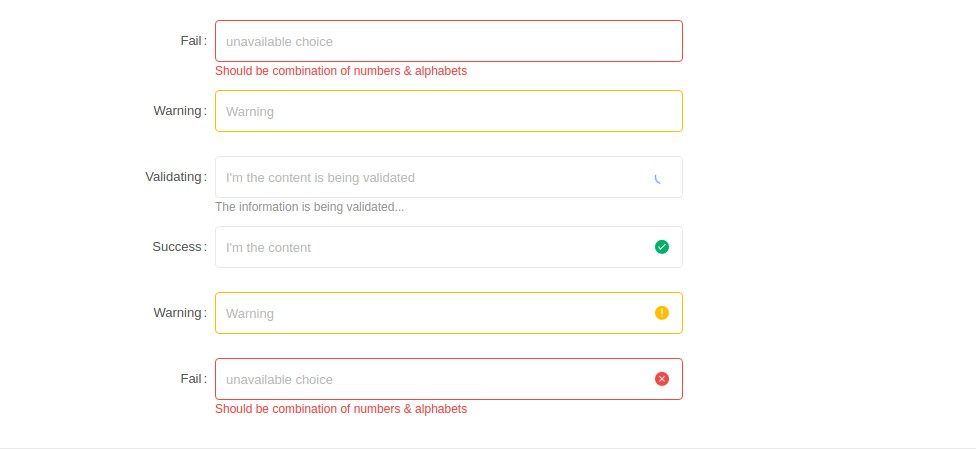

#### Code:
```jsx
const formItemLayout = {
  labelCol: {
    xs: { span: 24 },
    sm: { span: 5 },
  },
  wrapperCol: {
    xs: { span: 24 },
    sm: { span: 12 },
  },
};

export default class FormsWithValidation extends Component {
  render() {
    return (
      <LayoutWrapper>
        <PageHeader>Customized Validation Form</PageHeader>
        <Box>
          <Form>
            <FormItem
              {...formItemLayout}
              label="Fail"
              validateStatus="error"
              help="Should be combination of numbers &amp; alphabets"
            >
              <Input placeholder="unavailable choice" id="error" />
            </FormItem>

            <FormItem
              {...formItemLayout}
              label="Warning"
              validateStatus="warning"
            >
              <Input placeholder="Warning" id="warning" />
            </FormItem>

            <FormItem
              {...formItemLayout}
              label="Validating"
              hasFeedback
              validateStatus="validating"
              help="The information is being validated..."
            >
              <Input
                placeholder="I'm the content is being validated"
                id="validating"
              />
            </FormItem>

            <FormItem
              {...formItemLayout}
              label="Success"
              hasFeedback
              validateStatus="success"
            >
              <Input placeholder="I'm the content" id="success" />
            </FormItem>

            <FormItem
              {...formItemLayout}
              label="Warning"
              hasFeedback
              validateStatus="warning"
            >
              <Input placeholder="Warning" id="warning" />
            </FormItem>

            <FormItem
              {...formItemLayout}
              label="Fail"
              hasFeedback
              validateStatus="error"
              help="Should be combination of numbers &amp; alphabets"
            >
              <Input placeholder="unavailable choice" id="error" />
            </FormItem>
          </Form>
        </Box>
      </LayoutWrapper>
    );
  }
}
```

File Path: `your-dash-app-patha/src/containers/Forms/FormsWithValidation/index.js`

## Progress Bar:

### Standard Progress:

### Code:

```jsx
<Col md={12} xs={24} style={colStyle}>
  <Box title="Progress bar" subtitle="A standard progress bar.">
    <Progress percent={30} style={marginStyle} />
    <Progress percent={50} status="active" style={marginStyle} />
    <Progress percent={70} status="exception" style={marginStyle} />
    <Progress percent={100} style={marginStyle} />
    <Progress percent={50} showInfo={false} style={marginStyle} />
  </Box>
</Col>
```

File Path: `your-dash-app-patha/src/containers/Forms/Progress/index.js`

### Dynamic circular progress bar:

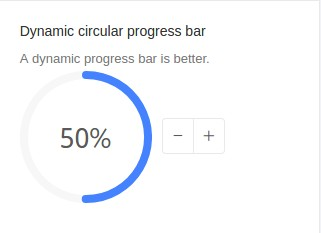

#### Code:
```jsx
<Col md={8} xs={24} style={colStyle}>
  <Box
    title="Dynamic circular progress bar"
    subtitle="A dynamic progress bar is better."
  >
    <Progress
      type="circle"
      percent={this.state.percent}
      style={marginStyle}
    />
    <ButtonGroup>
      <Button onClick={this.decline} icon="minus" />
      <Button onClick={this.increase} icon="plus" />
    </ButtonGroup>
  </Box>
</Col>
```

File Path: `your-dash-app-patha/src/containers/Forms/Progress/index.js`

### Custom text format:

#### Code:
```jsx
<Col md={12} sm={12} xs={24} style={colStyle}>
  <Box
    title="Custom text format"
    subtitle="You can custom text format by setting format."
  >
    <Progress
      type="circle"
      percent={75}
      format={percent => `${percent} Days`}
      style={marginStyle}
    />
    <Progress
      type="circle"
      percent={100}
      format={() => 'Done'}
      style={marginStyle}
    />
  </Box>
</Col>
```

File Path: `your-dash-app-patha/src/containers/Forms/Progress/index.js`

## Button:

### Button Type:

#### Code:
```jsx
<Col md={12} sm={12} xs={24} style={colStyle}>
  <Box title="Button Type">
    <ContentHolder>
      <Button type="primary" style={margin}>Primary</Button>
      <Button style={margin}>Default</Button>
      <Button type="dashed" style={margin}>Dashed</Button>
      <Button type="danger">Danger</Button>
    </ContentHolder>
  </Box>
</Col>
```

File Path: `src/containers/Forms/Button/index.js`

### Button Icon:

#### Code:
```jsx
<Col md={12} sm={12} xs={24} style={colStyle}>
  <Box title="Button Icon">
    <ContentHolder>
      <Button
        type="primary"
        shape="circle"
        icon="search"
        style={margin}
      />
      <Button type="primary" icon="search" style={margin}>
        Search
      </Button>
      <Button shape="circle" icon="search" style={margin} />
      <Button icon="search">Search</Button>
    </ContentHolder>

    <ContentHolder>
      <Button shape="circle" icon="search" style={margin} />
      <Button icon="search" style={margin}>Search</Button>
      <Button
        type="dashed"
        shape="circle"
        icon="search"
        style={margin}
      />
      <Button type="dashed" icon="search">Search</Button>
    </ContentHolder>
  </Box>
</Col>
```

File Path: `src/containers/Forms/Button/index.js`

### Button Size:
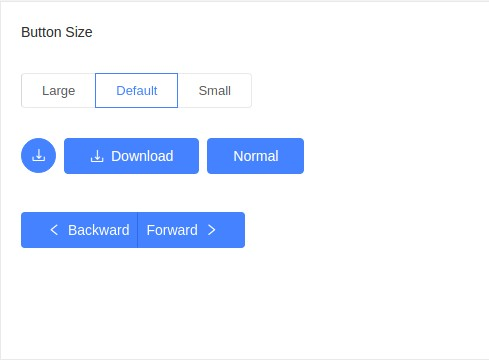

#### Code:
```jsx
<Col md={12} sm={12} xs={24} style={colStyle}>
  <Box title="Button Size">
    <ContentHolder>
      <Radio.Group value={size} onChange={this.handleSizeChange}>
        <Radio.Button value="large">Large</Radio.Button>
        <Radio.Button value="default">Default</Radio.Button>
        <Radio.Button value="small">Small</Radio.Button>
      </Radio.Group>
    </ContentHolder>

    <ContentHolder>
      <Button
        type="primary"
        shape="circle"
        icon="download"
        size={size}
        style={margin}
      />
      <Button
        type="primary"
        icon="download"
        size={size}
        style={margin}
      >
        Download
      </Button>
      <Button type="primary" size={size}>Normal</Button>
    </ContentHolder>

    <ContentHolder>
      <ButtonGroup size={size}>
        <Button type="primary">
          <Icon type="left" />Backward
        </Button>
        <Button type="primary">
          Forward<Icon type="right" />
        </Button>
      </ButtonGroup>
    </ContentHolder>
  </Box>
</Col>
```

File Path: `src/containers/Forms/Button/index.js`

### Button Loading:

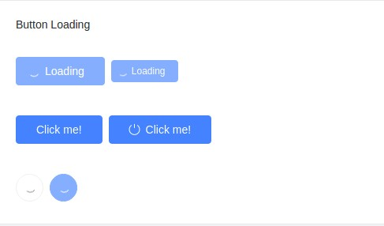

#### Code:
```jsx
<Col md={12} sm={12} xs={24} style={colStyle}>
  <Box title="Button Loading">
    <ContentHolder>
      <Button type="primary" loading style={margin}>
        Loading
      </Button>
      <Button type="primary" size="small" loading>
        Loading
      </Button>
    </ContentHolder>

    <ContentHolder>
      <Button
        type="primary"
        loading={this.state.loading}
        onClick={this.enterLoading}
        style={margin}
      >
        Click me!
      </Button>
      <Button
        type="primary"
        icon="poweroff"
        loading={this.state.iconLoading}
        onClick={this.enterIconLoading}
      >
        Click me!
      </Button>
    </ContentHolder>

    <ContentHolder>
      <Button shape="circle" loading style={margin} />
      <Button type="primary" shape="circle" loading />
    </ContentHolder>
  </Box>
</Col>
```

File Path: `src/containers/Forms/Button/index.js`

### Button Group:

#### Code:

```jsx
<Col md={12} sm={12} xs={24} style={colStyle}>
  <Box title="Button Group">
    <ContentHolder>
      <h4>Basic</h4>
      <ButtonGroup style={margin}>
        <Button>Cancel</Button>
        <Button type="primary">OK</Button>
      </ButtonGroup>
      <ButtonGroup style={margin}>
        <Button disabled>L</Button>
        <Button disabled>M</Button>
        <Button disabled>R</Button>
      </ButtonGroup>
      <ButtonGroup style={margin}>
        <Button type="primary">L</Button>
        <Button>M</Button>
        <Button>M</Button>
        <Button type="dashed">R</Button>
      </ButtonGroup>
    </ContentHolder>

    <ContentHolder>
      <h4>With Icon</h4>
      <ButtonGroup style={margin}>
        <Button type="primary">
          <Icon type="left" />Go back
        </Button>
        <Button type="primary">
          Go forward<Icon type="right" />
        </Button>
      </ButtonGroup>
      <ButtonGroup>
        <Button type="primary" icon="cloud" />
        <Button type="primary" icon="cloud-download" />
      </ButtonGroup>
    </ContentHolder>
  </Box>
</Col>
```

File Path: `src/containers/Forms/Button/index.js`

## Tabs:

### Basic Tab:

#### Code:
```jsx
<Box title="Basic Tabs">
  <Tabs defaultActiveKey="1" onChange={callback}>
    <TabPane tab="Tab 1" key="1">Content of Tab Pane 1</TabPane>
    <TabPane tab="Tab 2" key="2">Content of Tab Pane 2</TabPane>
    <TabPane tab="Tab 3" key="3">Content of Tab Pane 3</TabPane>
  </Tabs>
</Box>
```

File Path: `src/containers/Forms/Tab/index.js`

### Icon Tab:

#### Code:

```jsx
<Box title="Icon Tabs">
  <Tabs defaultActiveKey="2">
    <TabPane tab={<span><Icon type="apple" />Tab 1</span>} key="1">
      Tab 1
    </TabPane>
    <TabPane tab={<span><Icon type="android" />Tab 2</span>} key="2">
      Tab 2
    </TabPane>
  </Tabs>
</Box>
```

File Path: `src/containers/Forms/Tab/index.js`

### Position Tab:

#### Code:

```jsx
<Box
  title="Position"
  subtitle="Tabs's position: left, right, top or bottom"
>
  <div style={{ marginBottom: 16 }}>
    Tab position：
    <Select
      value={this.state.tabPosition}
      onChange={this.changeTabPosition}
      dropdownMatchSelectWidth={false}
    >
      <Option value="top">top</Option>
      <Option value="bottom">bottom</Option>
      <Option value="left">left</Option>
      <Option value="right">right</Option>
    </Select>
  </div>
  <Tabs tabPosition={this.state.tabPosition}>
    <TabPane tab="Tab 1" key="1">Content of Tab 1</TabPane>
    <TabPane tab="Tab 2" key="2">Content of Tab 2</TabPane>
    <TabPane tab="Tab 3" key="3">Content of Tab 3</TabPane>
  </Tabs>
</Box>
```

File Path: `src/containers/Forms/Tab/index.js`

### Add and Close Tabs:
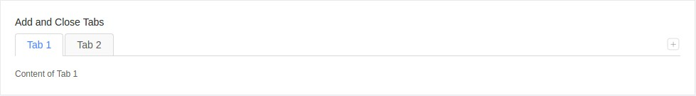

#### Code:

```jsx
<Box title="Add and Close Tabs">
  <Tabs
    onChange={this.onChange}
    activeKey={this.state.activeKey}
    type="editable-card"
    onEdit={this.onEdit}
  >
    {this.state.panes.map(pane => (
      <TabPane tab={pane.title} key={pane.key} closable={pane.closable}>
        {pane.content}
      </TabPane>
    ))}
  </Tabs>
</Box>
```

File Path: `src/containers/Forms/Tab/index.js`

### Vertical Type Tabs:


#### Code:

```jsx
<Box title="Vertical Type Tabs">
  <div className="card-container">
    <Tabs
      defaultActiveKey="1"
      tabPosition="left"
      style={{ height: 220 }}
    >
      <TabPane tab="Tab 1" key="1">Content of tab 1</TabPane>
      <TabPane tab="Tab 2" key="2">Content of tab 2</TabPane>
      <TabPane tab="Tab 3" key="3">Content of tab 3</TabPane>
      <TabPane tab="Tab 4" key="4">Content of tab 4</TabPane>
      <TabPane tab="Tab 5" key="5">Content of tab 5</TabPane>
      <TabPane tab="Tab 6" key="6">Content of tab 6</TabPane>
      <TabPane tab="Tab 7" key="7">Content of tab 7</TabPane>
      <TabPane tab="Tab 8" key="8">Content of tab 8</TabPane>
      <TabPane tab="Tab 9" key="9">Content of tab 9</TabPane>
      <TabPane tab="Tab 10" key="10">Content of tab 10</TabPane>
      <TabPane tab="Tab 11" key="11">Content of tab 11</TabPane>
    </Tabs>
  </div>
</Box>
```

File Path: `src/containers/Forms/Tab/index.js`

## Checkbox

### Basic Checkbox:

#### Code:

```jsx
<Col md={12} sm={12} xs={24} style={colStyle}>
  <Box title="Basic Checkbox" subtitle="Basic usage of checkbox.">
    <ContentHolder>
      <Checkbox onChange={this.handleOnChange}>Checkbox</Checkbox>
    </ContentHolder>
  </Box>
</Col>
```

### Checkbox Group:


#### Code:

```jsx
<Col md={12} sm={12} xs={24} style={colStyle}>
  <Box
    title="Checkbox Group"
    subtitle="Generate a group of checkboxes from an array. Use disabled to disable a checkbox."
  >
    <ContentHolder>
      <CheckboxGroup
        options={plainOptions}
        defaultValue={['Apple']}
        onChange={this.handleOnChange}
      />
      <br />
      <CheckboxGroup
        options={options}
        defaultValue={['Pear']}
        onChange={this.handleOnChange}
      />
      <br />
      <CheckboxGroup
        options={optionsWithDisabled}
        disabled
        defaultValue={['Apple']}
        onChange={this.handleOnChange}
      />
    </ContentHolder>
  </Box>
</Col>
```

### Checkbox Group 2:

#### Code:

```jsx
<Row style={rowStyle} gutter={gutter} justify="start">
  <Col md={12} sm={12} xs={24} style={colStyle}>
    <Box
      title="Checkbox Group"
      subtitle="Generate a group of checkboxes from an array. Use disabled to disable a checkbox."
    >
      <ContentHolder>
        <div>
          <div
            style={{
              borderBottom: '1px solid #E9E9E9',
              paddingBottom: '15px',
            }}
          >
            <Checkbox
              indeterminate={this.state.indeterminate}
              onChange={this.onCheckAllChange}
              checked={this.state.checkAll}
            >
              Check all
            </Checkbox>
          </div>
          <br />
          <CheckboxGroup
            options={plainOptions}
            value={this.state.checkedList}
            onChange={this.onChange}
          />
        </div>
      </ContentHolder>
    </Box>
  </Col>
</Row>
```

File Path: `src/containers/Forms/Checkbox/index.js`

## Radio

### Basic Radio:

#### Code:

```jsx
<Col md={12} sm={12} xs={24} style={colStyle}>
  <Box
    title="Basic Radio"
    subtitle="The simplest use. Use disabled to disable a radio."
  >
    <ContentHolder>
      <Radio>Radio</Radio>
      <br />
      <Radio defaultChecked={false} disabled>Disabled</Radio>
      <br />
      <Radio defaultChecked disabled>Disabled</Radio>
    </ContentHolder>
  </Box>
</Col>
```

File Path: `src/containers/Forms/Radiobox/index.js`


### Vertical RadioGroup:

#### Code:
```jsx
<Col md={12} sm={12} xs={24} style={colStyle}>
  <Box
    title="Vertical RadioGroup"
    subtitle="Vertical RadioGroup, with more radios."
  >
    <ContentHolder>
      <RadioGroup onChange={this.onChange} value={this.state.value}>
        <Radio style={radioStyle} value={1}>Option A</Radio>
        <Radio style={radioStyle} value={2}>Option B</Radio>
        <Radio style={radioStyle} value={3}>Option C</Radio>
        <Radio style={radioStyle} value={4}>
          More...
          {this.state.value === 4
            ? <Input style={{ width: 100, marginLeft: 10 }} />
            : null}
        </Radio>
      </RadioGroup>
    </ContentHolder>
  </Box>
</Col>
```

File Path: `src/containers/Forms/Radiobox/index.js`

### RadioGroup:

#### Code:

```jsx
<Col md={12} sm={12} xs={24} style={colStyle}>
  <Box title="RadioGroup" subtitle="A group of radio components.">
    <ContentHolder>
      <RadioGroup
        options={plainOptions}
        onChange={this.onChange1}
        value={this.state.value1}
        style={{ marginBottom: '10px' }}
      />
      <RadioGroup
        options={options}
        onChange={this.onChange2}
        value={this.state.value2}
        style={{ marginBottom: '10px' }}
      />
      <RadioGroup
        options={optionsWithDisabled}
        onChange={this.onChange3}
        value={this.state.value3}
      />
    </ContentHolder>
  </Box>
</Col>
```

File Path: `src/containers/Forms/Radiobox/index.js`

## Transfer:

### Transfer with a search box:

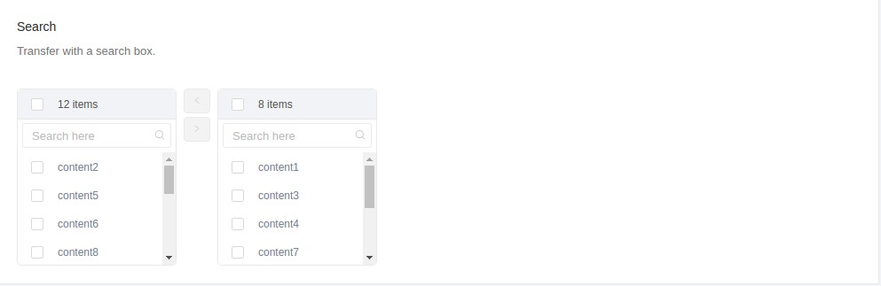

#### Code:

```jsx
export default class IsomorphicTransfer extends Component {
  state = {
    mockData: [],
    targetKeys: [],
  };
  componentDidMount() {
    this.getMock();
  }
  getMock = () => {
    const targetKeys = [];
    const mockData = [];
    for (let i = 0; i < 20; i++) {
      const data = {
        key: i.toString(),
        title: `content${i + 1}`,
        description: `description of content${i + 1}`,
        chosen: Math.random() * 2 > 1,
      };
      if (data.chosen) {
        targetKeys.push(data.key);
      }
      mockData.push(data);
    }
    this.setState({ mockData, targetKeys });
  };
  filterOption = (inputValue, option) => {
    return option.description.indexOf(inputValue) > -1;
  };
  handleChange = targetKeys => {
    this.setState({ targetKeys });
  };
  render() {
    return (
      <LayoutWrapper>
        <PageHeader>Transfer</PageHeader>

        <Box title="Search" subtitle="Transfer with a search box.">
          <ContentHolder>
            <Transfer
              dataSource={this.state.mockData}
              showSearch
              filterOption={this.filterOption}
              targetKeys={this.state.targetKeys}
              onChange={this.handleChange}
              render={item => item.title}
              className="isomorphicTransfer"
            />
          </ContentHolder>
        </Box>
      </LayoutWrapper>
    );
  }
}
```

File Path: `src/containers/Forms/Transfer/index.js`

### Autocomplete:

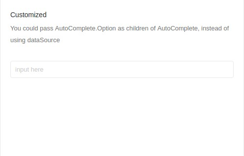

```jsx
<Col md={12} xs={24} style={colStyle}>
  <Box
    title="Customized"
    subtitle="You could pass AutoComplete.Option as children of AutoComplete, instead of using dataSource"
  >
    <ContentHolder>
      <AutoComplete
        onChange={this.handleCustomizedChange}
        placeholder="input here"
      >
        {children}
      </AutoComplete>
    </ContentHolder>
  </Box>
</Col>
```

File Path: `src/containers/Forms/AutoComplete/index.js`

### Customize Input Component:

#### Code:

```jsx
<Col md={12} xs={24} style={colStyle}>
  <Box
    title="Customize Input Component"
    subtitle="Customize Input Component"
  >
    <ContentHolder>
      <AutoComplete
        dataSource={dataSource}
        style={{ height: 200 }}
        onChange={this.handleChange}
        placeholder="input here"
      >
        <textarea style={{ height: 200 }} />
      </AutoComplete>
    </ContentHolder>
  </Box>
</Col>
```

File Path: `src/containers/Forms/AutoComplete/index.js`


