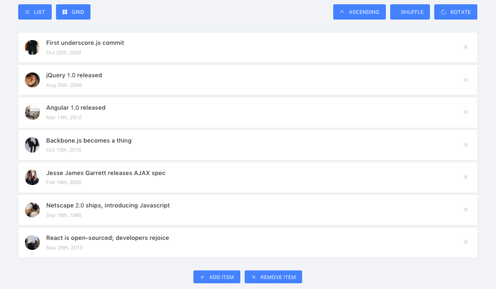

# Isotope

> To find out the code of Isotope, please go to your-apps-root-path/src/containers/Isotope

## View:

There are two kind of view for `Isotope`.

* List View
* Grid View

### List View:

This is the List view for `Isotope`.



### Grid View:

This is the Grid View of `Isotope`.


### Code:

The `Isotope` folder is divided into three parts, to make it understand better follow the below steps,

* index.js (main file)
* config.js (data config)
* Toggle.js (toogle component)

In the `index.js` file you will get all the necessary code.

You can get the code for `Grid or List item of the Isotope from the `renderArticles()` function.

and here is the function code,

```jsx
<ListItem
  key={article.id}
  view={this.state.view}
  index={i}
  clickHandler={throttle(
    () => this.moveArticle('articles', 'removedArticles', article.id),
    800,
  )}
  {...article}
/>
```

to get the code for ListItem copy the below code

```jsx
class ListItem extends Component {
  render() {
    const listClass = `isoSingleCard card ${this.props.view}`;
    const style = { zIndex: 100 - this.props.index };

    return (
      <li id={this.props.id} className={listClass} style={style}>
        <div className="isoCardImage">
          
        </div>
        <div className="isoCardContent">
          <h3 className="isoCardTitle">{this.props.desc}</h3>
          <span className="isoCardDate">
            {moment(this.props.timestamp).format('MMM Do, YYYY')}
          </span>
        </div>
        <button className="isoDeleteBtn" onClick={this.props.clickHandler}>
          <Icon type="close" />
        </button>
      </li>
    );
  }
}
```

### Options:

In the Isotope you will get several Necessary Options.

1. List or Grid Toggle.
2. Ascending or Descending
3. Shuffle
4. Rotate
5. Add Item
6. Remove Item
7. Animation

### List or Grid Toggle:

The `List or Grid Toogle` uses the `<Toogle/> component from the **Toogle.js** file. and here is the code forList or Grid Toggle from **index.js** file`

```jsx
<Toggle
  clickHandler={this.toggleList}
  text="List"
  icon="bars"
  active={this.state.view === 'list'}
/>

<Toggle
  clickHandler={this.toggleGrid}
  text="Grid"
  icon="appstore"
  active={this.state.view === 'grid'}
/>
```

the respective handler function can be found from `index.js` file.

### Ascending or Descending, Shuffle & Rotate:

Same as the previous `List or Grid Component`, Ascending or Descending, Shuffle & Rotatealso uses `theToogle component from index.js` file.

```jsx
<Toggle
  clickHandler={this.toggleSort}
  text={this.state.order === 'asc' ? 'Ascending' : 'Descending'}
  icon={this.state.order === 'asc' ? 'up' : 'down'}
  active={this.state.sortingMethod === 'chronological'}
/>

<Toggle
  clickHandler={this.sortShuffle}
  text="Shuffle"
  icon="random"
  active={this.state.sortingMethod === 'shuffle'}
/>

<Toggle
  clickHandler={this.sortRotate}
  text="Rotate"
  icon="reload"
  active={this.state.sortingMethod === 'rotate'}
/>
```

### Add Item or Remove Item:
At the end of the `Isotope` we have added the Item add or Remove functionality `in theindex.js` file

```jsx
<Toggle
  clickHandler={() =>
    this.moveArticle('removedArticles', 'articles')}
  text="Add Item"
  icon="plus"
  active={this.state.removedArticles.length > 0}
/>

<Toggle
  clickHandler={() =>
    this.moveArticle('articles', 'removedArticles')}
  text="Remove Item"
  icon="close"
  active={this.state.articles.length > 0}
/>
```

### Animation:
`Flipmove` Component been used to create the Animation in the `Isotope` Layout.

```jsx
<FlipMove
  staggerDurationBy="30"
  duration={500}
  enterAnimation={this.state.enterLeaveAnimation}
  leaveAnimation={this.state.enterLeaveAnimation}
  typeName="ul"
>
```


