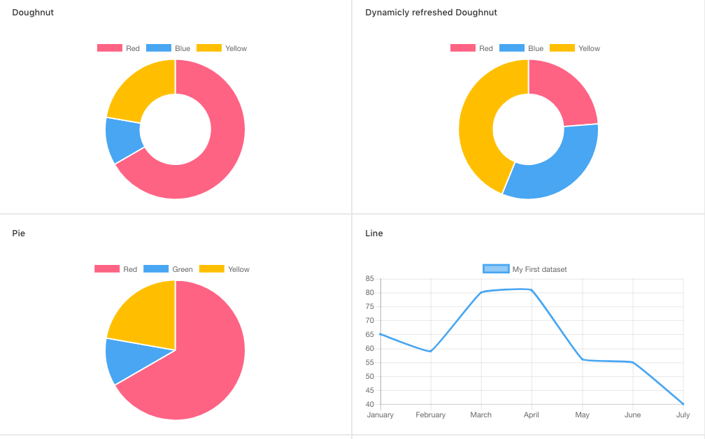

# React-Chart-2

Folder path: `/src/containers/charts/reactChart2`

API documentation of React-Chart-2: `https://github.com/gor181/react-chartjs-2`

If you want to render React trend chart component like the following image.




All the charts have the same format.

```jsx
<ReactChart2Type {...config} />
```

Example

```jsx
<Pie data={...} />
```

Will be found on `/src/containers/charts/reactChart2/{ChartType}/{ChartTypeconfig}.js`