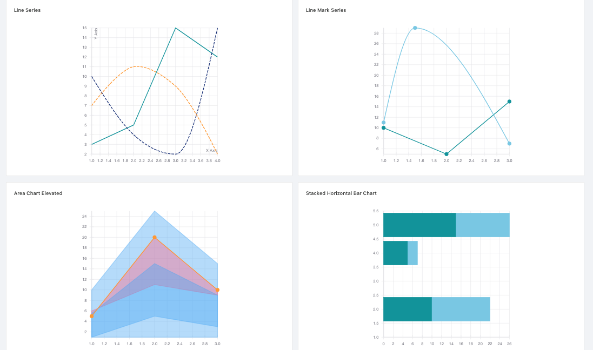
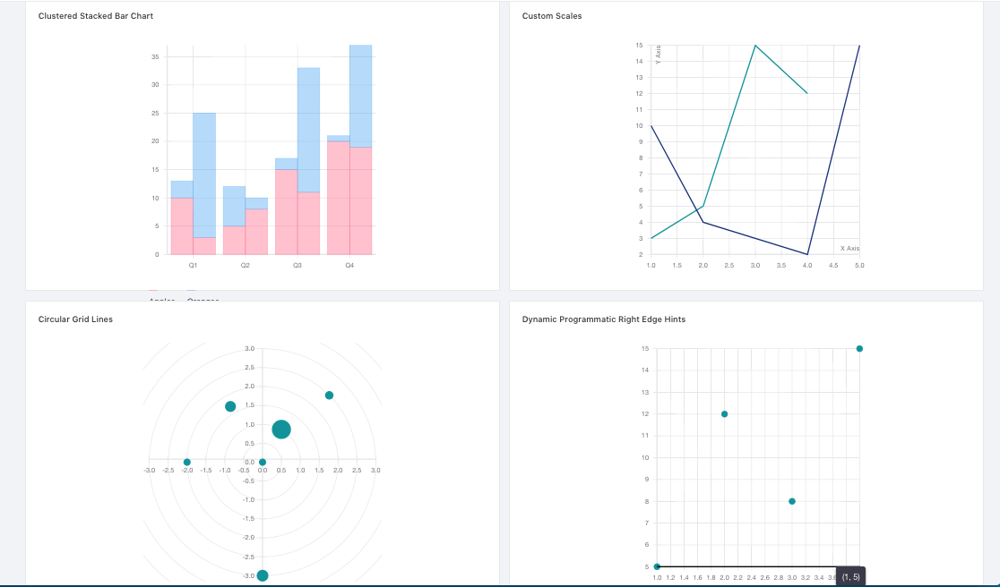
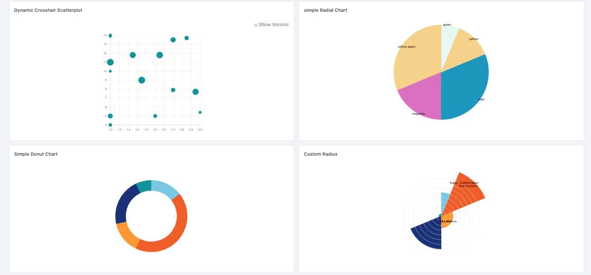
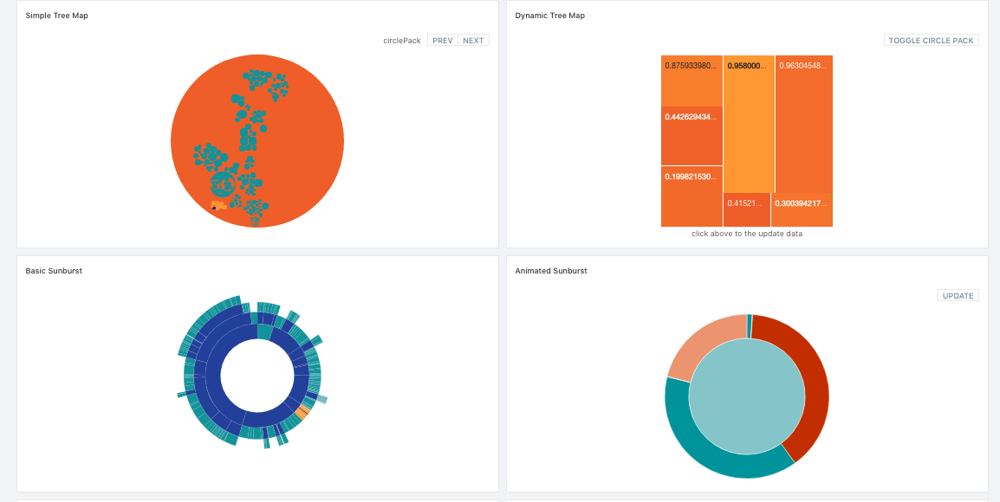
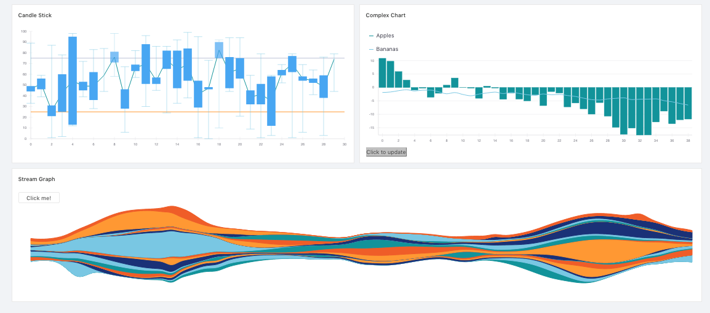

# ReactVis Charts

`Folder path: /src/containers/charts/reactVis`

API LInk: https://github.com/uber/react-vis

Configuration should be supplied from `/src/containers/charts/reactVis/config.js`

The followings are the images of the reactVis chart.



These are the charts of Line Series, Line Mark Series, Area Chart Elevated and Stacked Horizontal Bar Chart.



These are the Charts of Clustered Stacked Bar Chart, Custom Scales, Circular Grid Lines and Dynamic Programatic Right Edge Hints.



These are the Charts of Dynamic Crosshair Scatterplot, simple Radial Chart, Simple Donut Chart and Custom Radius.



These are the Charts of Simple Tree Map, Dynamic Tree Map, Basic Sunburst and Animated Sunburst.



hese are the Charts of Candle Stick, Complex Chart and Stream Graph.

All the charts have the same format.

```jsx
<ReactVisChartType {...config} />
```

Example

```jsx
<LineSeries {...configs.LineSeries} />
```

Will be found on `/src/containers/charts/reactVis/config.js`

