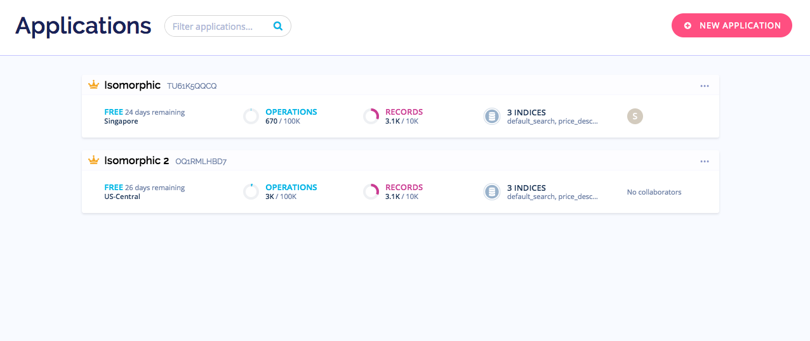
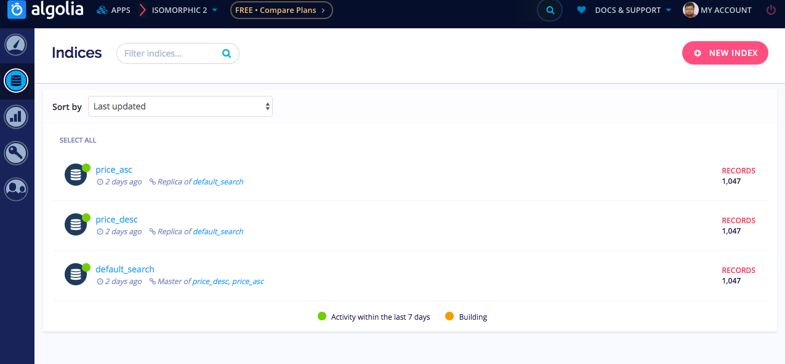
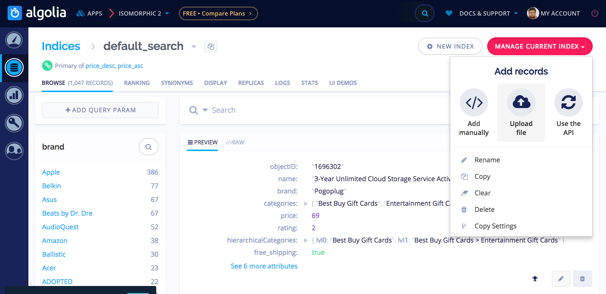
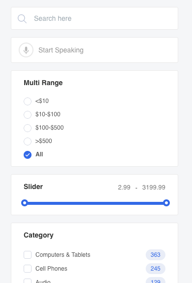
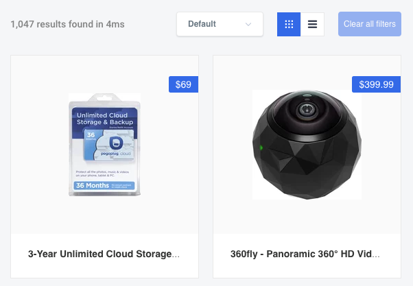
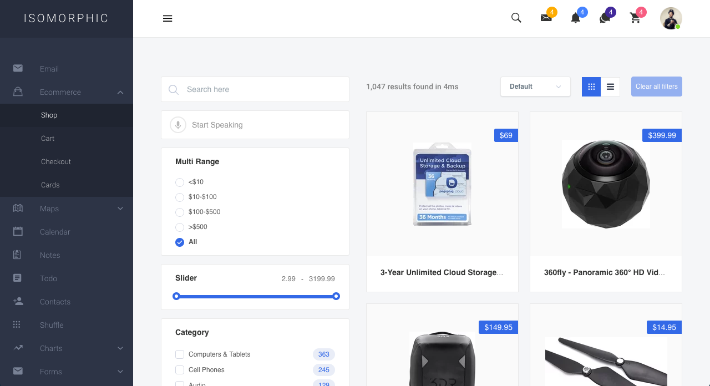

# Shop (Algolia)

We have provided shop page in **Isomorphic**. A searching system is also provided with the help of [Algolia](https://www.algolia.com/).

### Why Algolia
* Its always better to search from the JSON data instead of searching from the DB.
* Get Result in milliseconds.
* Easier Integration

### How to Use

#### Algolia Dashboard Part

To Use aloglia, first you need to go to algolia official website and open an app and provide Necessary indices and data and configure as per as their [documentation](https://www.algolia.com/doc/).



First you need to create an app after signing in to algolia.

Then entering into the application that is created, the admin dashboard will look like the following.



In algolia the search is truely dependent on the indices. So its time to create a indices. And after that the indices should be modified in order to use. So, the arrays of data on which the search operations should be done, should be uploaded. A JSON file can serve the purpose.



More details on configuring the Algolia for using from Web SDK can be found [here](https://www.algolia.com/doc/).

#### On Isomorphic Project
The data we have worked on is simple like the following

```json
 {
    "name": "3-Year Unlimited Cloud Storage Service Activation Card - Other",
    "description": "Enjoy 3 years of unlimited Cloud storage service with this activation card, which allows you to remotely access your favorite music, movies and other media via a compatible device and enables private file sharing with loved ones.",
    "brand": "Pogoplug",
    "categories": [
      "Best Buy Gift Cards",
      "Entertainment Gift Cards"
    ],
    "hierarchicalCategories": {
      "lvl0": "Best Buy Gift Cards",
      "lvl1": "Best Buy Gift Cards > Entertainment Gift Cards"
    },
    "type": "Online data backup",
    "price": 69,
    "price_range": "50 - 100",
    "image": "https://cdn-demo.algolia.com/bestbuy/1696302_sc.jpg",
    "url": "http://www.bestbuy.com/site/3-year-unlimited-cloud-storage-service-activation-card-other/1696302.p?id=1219066776306&skuId=1696302&cmp=RMX&ky=1uWSHMdQqBeVJB9cXgEke60s5EjfS6M1W",
    "free_shipping": true,
    "popularity": 10000,
    "rating": 2,
    "objectID": "1696302"
  }
```

The Total Project is structured in such a systematic way that can be easily understandable by any developer.

| File Path      | Uses |
| ----------- | ----------- |
| src/config.js      | App Credentials like appId and apiKey       |
| src/containers/Ecommerce/algolia/instantSearch.js      | Entery point for Ecommerce Shop Page       |
| src/containers/Ecommerce/algolia/desktopview.js or src/containers/Ecommerce/algolia/mobileview.js      | Entry point for Algolia Components based on device (Mobile or Desktop)       |
| src/components/algolia/sidebar      | Side bar component that holds the search elements       |
| src/components/algolia/contents      | The Grid part that shows the Product overview       |
| src/components/algolia/footer      | 	Footer of the Shop page       |


In our project you will find the algolio config on the path `src/config.js` . You should provide two options from that is essential.

```js
const AlgoliaSearchConfig = {
  appId: '',
  apiKey: ''
};
```

In the Entrey point for algolia components a config should be provided indicating the available options like URL sync, indices name etc.

```js
const searchInfo = {
      ...AlgoliaSearchConfig,
      indexName: 'default_search',
      searchState: this.state.searchState,
      urlSync: true,
      onSearchStateChange: searchState => {
        this.setState({ searchState });
        setUrl(searchState);
      },
    };
```

and this config should be passed to a react component([react-instantsearch/dom](https://github.com/algolia/react-instantsearch)) like the following.

```jsx
<InstantSearch {...searchInfo}>
    <div className="isoAlgoliaMainWrapper">
      <Sidebar setVoice={this.setVoice} />
        <Content />
    </div>
      <Footer />
</InstantSearch>
```

Sidebar component holds the search elements. For example for a rangebox the following code should be placed in the sidebar.

```jsx
<MultiRange
        attributeName="price"
        items={[
          { end: 10, label: '<$10' },
          { start: 10, end: 100, label: '$10-$100' },
          { start: 100, end: 500, label: '$100-$500' },
          { start: 500, label: '>$500' }
        ]}
      />
```



Content components hold the Product overview part and the pagination . in other word we can call it as grid. Single Grid path is `src/components/algolia/hit.js`



So the total outlook of our shop page will be something like the following.


