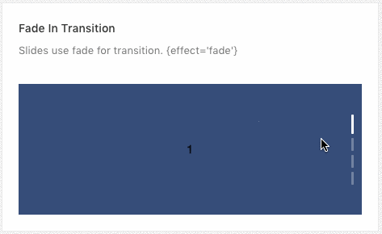
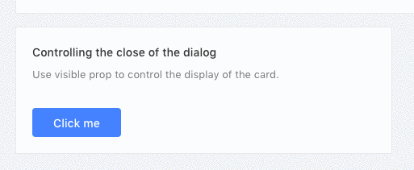
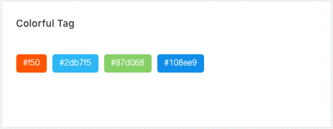

# UI Elements

11 unique UI Elements are available with this template.

* Badge
* Card
* Carousel
* Collapse
* Popover
* Tooltip
* Tag
* Timeline
* Dropdown
* Pagination
* Rating

You will find this in the left sidebar menu. The screenshot is given below.


## Badge
4 types of badge design are available inside badge menu. You can use any of this. To use this follow the instruct code example given below.

### Basic Example


To show this type of badge you will need this code in down here.

```jsx
<Badge count={5}>
    <a className="isoBadgeLink"> </a>
</Badge>
```

### Overflow Count


If your number of badge is too large then use the overflow count example code.

```jsx
<Badge count={1000} overflowCount={999}>
    <a className="isoBadgeLink"> </a>
</Badge>
```

### Status


Available status colors are here.

```jsx
<Badge status="success" />
<Badge status="error" />
<Badge status="default" />
<Badge status="processing" />
<Badge status="warning" />
```

### Red Badge


You can add it to any link or some icon.

```jsx
<Badge dot>
    <Icon type="notification" />
</Badge>
<Badge dot>
    <a href=".">Link something</a>
</Badge>
```

Available parameters, type and descriptions are down below.

| Parameter      | Type | Description |
| ----------- | ----------- | ----------- |
| count      | integer       | give the no you want to show as notification       |
| overflowCount      | integer       | maximum threshold value for showing the counter display       |
| status      | string       | success, error, default, processing, warning are available for choosing color option.       |
| dot      | null       | only show a red dot       |

You will find the example code inside `src/containers/Uielements/Badge/index.js` .

## Card
Multiple types of cards are available with this isomorphic template.

### Basic Card


Simple basic card preview.

```jsx
<Card
  title="Card title"
  extra={<a>More</a>}
  style={{ width: '100%' }}
>
  <p>
    Lorem ipsum dolor sit amet, consectetur adipisicing elit, sed do eiusmod tempor incididunt ut labore et dolore magna aliqua. Ut enim ad minim veniam, quis nostrud exercitation ullamco laboris nisi ut aliquip ex ea commodo consequat.
  </p>
  <p>Card content</p>
</Card>
```

### No border


Card without border preview screenshot will look like this, and the example code you need:

```jsx
<Card
  title="Card title"
  bordered={false}
  style={{ width: '100%' }}
>
  <p>
    Lorem ipsum dolor sit amet, consectetur adipisicing elit, sed do eiusmod tempor incididunt ut labore et dolore magna aliqua. Ut enim ad minim veniam, quis nostrud exercitation ullamco laboris nisi ut aliquip ex ea commodo consequat.
  </p>
  <p>Card content</p>
</Card>
```

### Grid Card
You can preview your card in grid system. To use grid follow the steps.


```jsx
<Row>
  <Col span="8">
    <Card title="Card title">Card content</Card>
  </Col>
  <Col span="8">
    <Card title="Card title">Card content</Card>
  </Col>
  <Col span="8">
    <Card title="Card title">Card content</Card>
  </Col>
</Row>
```

### Loading Card


```jsx
<Card loading title="Card title" style={{ width: '100%' }}>
    Whatever content
</Card>
```

### Customized Content


You can customize your card any type of design you want.

```jsx
<Card bodyStyle={{ padding: 0 }}>
  <div className="custom-image">
    
  </div>
  <div className="custom-card">
    <h3>Europe Street beat</h3>
    <p>www.instagram.com</p>
  </div>
</Card>
```

Available parameters, type and descriptions are down below.

| Parameter      | Type |  Description |
| ----------- | ----------- | ----------- |
| title      | string       | enter your card title       |
| extra      | html       | you can add HTML content       |
| style      | object       | use custom css style       |
| bordered      | boolean       | show/hide card border       |
| loading      | null       | it will show animated loading card       |
| bodyStyle      | object       | use custom css body style       |


## Carousal

Simple but effective carousel are added with this template.Using the carousel is very easy and just need some simple step.

### Basic Carousal


```jsx
<Carousel afterChange={this.onChange}>
    <div><h3>1</h3></div>
    <div><h3>2</h3></div>
    <div><h3>3</h3></div>
    <div><h3>4</h3></div>
</Carousel>
```

### Vertical Carousel


```jsx
<Carousel vertical="true">
    <div><h3>1</h3></div>
    <div><h3>2</h3></div>
    <div><h3>3</h3></div>
    <div><h3>4</h3></div>
</Carousel>
```

### Scroll Automatically


```jsx
<Carousel autoplay>
    <div><h3>1</h3></div>
    <div><h3>2</h3></div>
    <div><h3>3</h3></div>
    <div><h3>4</h3></div>
</Carousel>
```

Available parameters, type and descriptions are down below.

| Parameter      | Type |  Description |
| ----------- | ----------- | ----------- |
| afterChange      | function       | you can use the callback function after change       |
| vertical      | boolean       | enable to show vertical carousel       |
| autoplay      | null       | scroll automatically       |


## Collapse

### Basic Collapse / Accordion


```jsx
<Collapse accordion>
  <Panel header={'This is panel header 1'} key="1">
    <p>{text}</p>
  </Panel>
  <Panel header={'This is panel header 2'} key="2">
    <p>{text}</p>
  </Panel>
  <Panel header={'This is panel header 3'} key="3">
    <p>{text}</p>
  </Panel>
</Collapse>
```

### Nested Example


```jsx
<Collapse onChange={this.callback}>
  <Panel header={'This is panel header 1'} key="1">
    <Collapse defaultActiveKey="1">
      <Panel header={'This is panel nest panel'} key="1">
        <p>{text}</p>
      </Panel>
    </Collapse>
  </Panel>
  <Panel header={'This is panel header 2'} key="2">
    <p>{text}</p>
  </Panel>
  <Panel header={'This is panel header 3'} key="3">
    <p>{text}</p>
  </Panel>
</Collapse>
```

### Borderless Example


```jsx
<Collapse bordered={false} defaultActiveKey={['1']}>
  <Panel header="This is panel header 1" key="1">
    <p>{text}</p>
  </Panel>
  <Panel header="This is panel header 2" key="2">
    <p>{text}</p>
  </Panel>
  <Panel header="This is panel header 3" key="3">
    <p>{text}</p>
  </Panel>
</Collapse>
```

Available parameters on ***Collapse***, type and descriptions are down below.

| Parameter      | Type |  Description |
| ----------- | ----------- | ----------- |
| onChange      | function       | callback function       |
| accordion      | null       | accordion type       |
| bordered      | boolean       | 	show / hide border       |
| defaultActiveKey      | object       | default active       |

Available parameters on ***Panel***, type and descriptions are down below.

| Parameter      | Type |  Description |
| ----------- | ----------- | ----------- |
| header      | string       | enter panel title       |
| key      | integer       | add unique identifier for each panel       |


## Popover

### Basic Example


```jsx
<Popover content={content} title="Title">
    <Button type="primary">Hover me</Button>
</Popover>
```

### Three ways to trigger


```jsx
<Popover content={content} title="Title" trigger="hover">
  <Button className="demoBtn">Hover me</Button>
</Popover>
<Popover content={content} title="Title" trigger="focus">
  <Button className="demoBtn">Focus me</Button>
</Popover>
<Popover content={content} title="Title" trigger="click">
  <Button className="demoBtn">Click me</Button>
</Popover>
```

### Placement Options


```jsx
<Popover
  placement="topLeft"
  title="Top Left"
  content={content}
  trigger="click"
>
  <Button className="demoPosBtn">TL</Button>
</Popover>
<Popover
  placement="top"
  title="Top"
  content={content}
  trigger="click"
>
  <Button className="demoPosBtn">Top</Button>
</Popover>
<Popover
  placement="topRight"
  title="Top Right"
  content={content}
  trigger="click"
>
  <Button className="demoPosBtn">TR</Button>
</Popover>
</div>
<div
className="demoBtnsWrapper"
style={{ width: buttonWidth, float: 'left' }}
>
<Popover
  placement="leftTop"
  title="Left Top"
  content={content}
  trigger="click"
>
  <Button className="demoPosBtn">LT</Button>
</Popover>
<Popover
  placement="left"
  title="Left"
  content={content}
  trigger="click"
>
  <Button className="demoPosBtn">Left</Button>
</Popover>
<Popover
  placement="leftBottom"
  title="Left Bottom"
  content={content}
  trigger="click"
>
  <Button className="demoPosBtn">LB</Button>
</Popover>
<Popover
  placement="rightTop"
  title="Right Top"
  content={content}
  trigger="click"
>
  <Button className="demoPosBtn">RT</Button>
</Popover>
<Popover
  placement="right"
  title="Right"
  content={content}
  trigger="click"
>
  <Button className="demoPosBtn">Right</Button>
</Popover>
<Popover
  placement="rightBottom"
  title="Right Bottom"
  content={content}
  trigger="click"
>
  <Button className="demoPosBtn">RB</Button>
</Popover>

<Popover
  placement="bottomLeft"
  title="Bottom Left"
  content={content}
  trigger="click"
>
  <Button className="demoPosBtn">BL</Button>
</Popover>
<Popover
  placement="bottom"
  title="Bottom"
  content={content}
  trigger="click"
>
  <Button className="demoPosBtn">Bottom</Button>
</Popover>
<Popover
  placement="bottomRight"
  title="Bottom Right"
  content={content}
  trigger="click"
>
  <Button className="demoPosBtn">BR</Button>
</Popover>
```

### Controlling the close of the dialog


```jsx
<Popover
  content={<a onClick={this.hide}>Close</a>}
  title="Title"
  trigger="click"
  visible={this.state.visible}
  onVisibleChange={this.handleVisibleChange}
>
  <Button type="primary">Click me</Button>
</Popover>
```

Available parameters, type and descriptions are down below.

| Parameter      | Type |  Description |
| ----------- | ----------- | ----------- |
| title      | string       | popover title       |
| content      | html       | popover content       |
| trigger      | options       | hover, focus, click       |
| visible      | boolean       | visible state change       |
| onVisibleChange      | function       | callback function       |
| placement      | options       | topLeft, top, topRight, leftTop, left, leftBottom, rightTop, right, rightBottom, bottomLeft, bottom, bottomRight       |


## Tooltip

Every templates needs some basic tooltip in some places to focus the content more precisely. Here we have some tooltip options available for you.

### Basic Example


```jsx
<Tooltip title="Tooltip Content">
    <span>Tooltip will show when mouse enter.</span>
</Tooltip>
```

### Placement Options


Multiple placement options are available with the tooltip.

```jsx
<Tooltip placement="topLeft" title={text}>
  <a className="tooltipBtn">TL</a>
</Tooltip>
<Tooltip placement="top" title={text}>
  <a className="tooltipBtn">Top</a>
</Tooltip>
<Tooltip placement="topRight" title={text}>
  <a className="tooltipBtn">TR</a>
</Tooltip>
<Tooltip placement="leftTop" title={text}>
  <a className="tooltipBtn">LT</a>
</Tooltip>
<Tooltip placement="left" title={text}>
  <a className="tooltipBtn">Left</a>
</Tooltip>
<Tooltip placement="leftBottom" title={text}>
  <a className="tooltipBtn">LB</a>
</Tooltip>
<Tooltip placement="rightTop" title={text}>
  <a className="tooltipBtn">RT</a>
</Tooltip>
<Tooltip placement="right" title={text}>
  <a className="tooltipBtn">Right</a>
</Tooltip>
<Tooltip placement="rightBottom" title={text}>
  <a className="tooltipBtn">RB</a>
</Tooltip>
<Tooltip placement="bottomLeft" title={text}>
  <a className="tooltipBtn">BL</a>
</Tooltip>
<Tooltip placement="bottom" title={text}>
  <a className="tooltipBtn">Bottom</a>
</Tooltip>
<Tooltip placement="bottomRight" title={text}>
  <a className="tooltipBtn">BR</a>
</Tooltip>
```

Available parameters, type and descriptions/options are down below.

| Parameter      | Type |  Description |
| ----------- | ----------- | ----------- |
| title      | string       | 	title for tooltip       |
| placement      | options       | topLeft, top, topRight, leftTop, left, leftBottom, rightTop, right, rightBottom, bottomLeft, bottom, bottomRight |


## Tag

Basic tag systems are included with this template.

### Basic Example


```jsx
<Tag>Tag 1</Tag>
<Tag>
  <a
    href="https://redq.io"
  >
    Link
  </a>
</Tag>
<Tag closable onClose={this.log}>Tag 2</Tag>
<Tag closable onClose={this.preventDefault}>
  Prevent Default
</Tag>
```

### Colorful Tag


```jsx
<Tag color="#f50">#f50</Tag>
<Tag color="#2db7f5">#2db7f5</Tag>
<Tag color="#87d068">#87d068</Tag>
<Tag color="#108ee9">#108ee9</Tag>
```

### Hot Tags


```jsx
const tagsFromServer = ['Movie', 'Books', 'Music'];
{tagsFromServer.map(tag => (
  <CheckableTag
    key={tag}
    checked={selectedTags.indexOf(tag) > -1}
    onChange={checked => this.handleChange(tag, checked)}
  >
    {tag}
  </CheckableTag>
))}
```

### Add & Remove Dynamically


```jsx
// in the state
state = {
  selectedTags: [],
  tags: ['Unremovable', 'Tag 2', 'Tag 3'],
  inputVisible: false,
  inputValue: '',
};
// and inside the render method
{tags.map((tag, index) => {
  const isLongTag = tag.length > 20;
  const tagElem = (
    <Tag
      key={tag}
      closable={index !== 0}
      afterClose={() => this.handleClose(tag)}
    >
      {isLongTag ? `${tag.slice(0, 20)}...` : tag}
    </Tag>
  );
  return isLongTag
    ? <Tooltip title={tag}>{tagElem}</Tooltip>
    : tagElem;
})}
{inputVisible &&
<Input
  ref={this.saveInputRef}
  type="text"
  size="small"
  style={{ width: 78 }}
  value={inputValue}
  onChange={this.handleInputChange}
  onBlur={this.handleInputConfirm}
  onPressEnter={this.handleInputConfirm}
/>}
{!inputVisible &&
<Button size="small" type="dashed" onClick={this.showInput}>
  + New Tag
</Button>}
```

Available parameters, type and descriptions/options are down below.

| Parameter      | Type |  Description |
| ----------- | ----------- | ----------- |
| key      | integer       | unique identifier for tag       |
| closable      | null       | removable tag       |
| onClose      | function       | on close callback function       |
| color      | hex color       | put hex color value e.g. #2db7f5       |
| checked      | function       | on checked callback function       |
| afterClose      | function       | callback function       |

## Timeline

## Basic Example


```jsx
<Timeline>
  <Timeline.Item>
    Create a services site 2015-09-01
  </Timeline.Item>
  <Timeline.Item>
    Solve initial network problems 2015-09-01
  </Timeline.Item>
  <Timeline.Item>Technical testing 2015-09-01</Timeline.Item>
  <Timeline.Item>
    Network problems being solved 2015-09-01
  </Timeline.Item>
</Timeline>
```

### Color Example


```jsx
<Timeline>
  <Timeline.Item color="green">
    Create a services site 2015-09-01
  </Timeline.Item>
  <Timeline.Item color="green">
    Create a services site 2015-09-01
  </Timeline.Item>
  <Timeline.Item color="red">
    <p>Solve initial network problems 1</p>
    <p>Solve initial network problems 2</p>
    <p>Solve initial network problems 3 2015-09-01</p>
  </Timeline.Item>
  <Timeline.Item>
    <p>Technical testing 1</p>
    <p>Technical testing 2</p>
    <p>Technical testing 3 2015-09-01</p>
  </Timeline.Item>
</Timeline>
```

### Custom Timeline


```jsx
<Timeline>
  <Timeline.Item>
    Create a services site 2015-09-01
  </Timeline.Item>
  <Timeline.Item>
    Solve initial network problems 2015-09-01
  </Timeline.Item>
  <Timeline.Item
    dot={
      (
        <Icon
          type="clock-circle-o"
          style={{ fontSize: '16px' }}
        />
      )
    }
    color="red"
  >
    Technical testing 2015-09-01
  </Timeline.Item>
  <Timeline.Item>
    Network problems being solved 2015-09-01
  </Timeline.Item>
</Timeline>
```

### Last Node


```jsx
<Timeline pending={<a>See more</a>}>
  <Timeline.Item>
    Create a services site 2015-09-01
  </Timeline.Item>
  <Timeline.Item>
    Solve initial network problems 2015-09-01
  </Timeline.Item>
  <Timeline.Item>Technical testing 2015-09-01</Timeline.Item>
</Timeline>
```

Available parameters, type and descriptions for Timeline are down below.

| Parameter      | Type |  Description |
| ----------- | ----------- | ----------- |
| pending      | data content       | add some content as last node       |


Available parameters, type and descriptions for ***Timeline.Item*** are down below.

| Parameter      | Type |  Description |
| ----------- | ----------- | ----------- |
| color      | 	color value       | add color value here       |
| dot      | 	custom content       | you can add custom content inside dot parameter       |


## Dropdown

### Hover Dropdown


```jsx
// Menu component
const menuHover = (
  <Menu>
    <Menu.Item>
      <a target="_blank" rel="noopener noreferrer" href="http://redq.io/">
        1st menu item
      </a>
    </Menu.Item>
    <Menu.Item>
      <a target="_blank" rel="noopener noreferrer" href="http://redq.io/">
        2nd menu item
      </a>
    </Menu.Item>
    <Menu.Item>
      <a target="_blank" rel="noopener noreferrer" href="http://redq.io/">
        3d menu item
      </a>
    </Menu.Item>
  </Menu>
);

// In the render method
<Dropdown overlay={menuHover}>
  <a className="ant-dropdown-link">
    Hover me <Icon type="down" />
  </a>
</Dropdown>
```

### Hover Placement Drop Down


```jsx
<Dropdown overlay={menuHover} placement="bottomLeft">
  <Button style={demoStyle}>bottomLeft</Button>
</Dropdown>
<Dropdown overlay={menuHover} placement="bottomCenter">
  <Button style={demoStyle}>bottomCenter</Button>
</Dropdown>
<Dropdown overlay={menuHover} placement="bottomRight">
  <Button style={demoStyle}>bottomRight</Button>
</Dropdown>
<br />
<Dropdown overlay={menuHover} placement="topLeft">
  <Button style={demoStyle}>topLeft</Button>
</Dropdown>
<Dropdown overlay={menuHover} placement="topCenter">
  <Button style={demoStyle}>topCenter</Button>
</Dropdown>
<Dropdown overlay={menuHover} placement="topRight">
  <Button style={demoStyle}>topRight</Button>
</Dropdown>
```

### Hover Drop Down with Disable link


```jsx
<Dropdown overlay={menuHoverDisable}>
  <a className="ant-dropdown-link">
    Hover me <Icon type="down" />
  </a>
</Dropdown>
```

### Clicked Drop Down

)

```jsx
<Dropdown overlay={menuHover} trigger={['click']}>
  <a className="ant-dropdown-link">
    Click me <Icon type="down" />
  </a>
</Dropdown>
```

### Button with dropdown menu


```jsx
<Dropdown.Button
  onClick={this.handleButtonClick}
  overlay={menuClicked}
>
  Dropdown
</Dropdown.Button>
<Dropdown.Button
  onClick={this.handleButtonClick}
  overlay={menuClicked}
  disabled
  style={{ marginLeft: 8 }}
>
  Dropdown
</Dropdown.Button>
<Dropdown overlay={menuClicked}>
  <Button style={{ marginLeft: 8 }}>
    Button <Icon type="down" />
  </Button>
</Dropdown>
```

### Clicked Drop Down


```jsx
<Dropdown overlay={menuSubmenu}>
  <a className="ant-dropdown-link">
    Cascading menu <Icon type="down" />
  </a>
</Dropdown>
```

Available parameters, type and descriptions for ***Dropdown*** are down below.

| Parameter      | Type |  Description |
| ----------- | ----------- | ----------- |
| overlay      | component       | dropdown menu component       |
| placement      | options       | bottomLeft, bottomCenter, bottomRight, topLeft, topCenter, topRight       |
| trigger      | options       | ['click']       |

Available parameters, type and descriptions for ***Dropdown.Button*** are down below.

| Parameter      | Type |  Description |
| ----------- | ----------- | ----------- |
| overlay      | component       | dropdown menu component       |
| style      | object       | css style object       |
| disabled      | null       | disable button       |
| onClick      | function       | callback function       |


## Pagination

### Basic


```jsx
<Pagination defaultCurrent={1} total={50} />
```

### More


```jsx
<Pagination defaultCurrent={6} total={500} />
```


### Changer


```jsx
<Pagination
    showSizeChanger
    onShowSizeChange={this.onShowSizeChange}
    defaultCurrent={3}
    total={500}
/>
```

### Jumper


```jsx
<Pagination
    showQuickJumper
    defaultCurrent={2}
    total={500}
    onChange={this.onChange}
/>
```

### Mini Size


```jsx
<Pagination size="small" total={50} />

<Pagination
  size="small"
  total={50}
  showSizeChanger
  showQuickJumper
/>
<Pagination
  size="small"
  total={50}
  showTotal={this.showTotal}
/>
```

### Simple Mode


```jsx
<Pagination simple defaultCurrent={2} total={50} />
```

### Controlled


```jsx
<Pagination
    current={this.state.current}
    onChange={this.onChangeControlled}
    total={50}
/>
```

### Total Number


```jsx
<Pagination
  total={85}
  showTotal={total => `Total ${total} items`}
  pageSize={20}
  defaultCurrent={1}
/>

<Pagination
  total={85}
  showTotal={(total, range) =>
    `${range[0]}-${range[1]} of ${total} items`}
  pageSize={20}
  defaultCurrent={1}
/>
```

Available parameters, type and descriptions for are down below.

| Parameter      | Type |  Description |
| ----------- | ----------- | ----------- |
| defaultCurrent      | integer       | current page number       |
| total      | integer       | total no of pages       |
| showSizeChanger      | null       | show/hide size changer       |
| onShowSizeChange      | function       | callback function       |
| showQuickJumper      | null       | show/hide quick jumper input option       |
| size      | options       | pagination size. e.g. small       |


## Rating

### Basic Example


```jsx
<Rate />
```

### Half Star


```jsx
<Rate allowHalf defaultValue={2.5} />
```

### Show copywriting


```jsx
<Rate onChange={this.handleChange} value={value} />
```

### Read Only


```jsx
<Rate disabled defaultValue={2} />
```

### Other Character


```jsx
<Rate character={<Icon type="heart" />} allowHalf />

<Rate character="A" allowHalf style={{ fontSize: 36 }} />
```

Available parameters, type and descriptions for are down below.

| Parameter      | Type |  Description |
| ----------- | ----------- | ----------- |
| defaultValue      | float       | show rating default value       |
| allowHalf      | null       | allow half rating input       |
| onChange      | function       | callback function       |
| value      | float       | value for rating       |
| disabled      | null       | read only mode       |
| character      | component       | icon component       |
| style      | style object       | put css object if you want to styling       |


