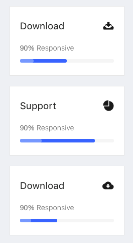

# widgets

> To find out the code of widgets, please go to your-apps-root-path/src/containers/widgets

## ReportsWidget


You will find the code at your-apps-root-path/src/containers/widgets/report/report-widget.js.

Then, the file is imported in your-apps-root-path/src/containers/widgets/index.js file.

### Code:

```jsx
<IsoWidgetsWrapper>
              {/* Report Widget */}
              <ReportsWidget
                label="Income"
                details="Lorem ipsum dolor sit amet, consectetur adipisicing elit, sed do eiusmod tempor"
              >
                <SingleProgressWidget
                  label="Marketing"
                  percent={70}
                  barHeight={7}
                  status="active"
                  info={true}
                />
                <SingleProgressWidget
                  label="Addvertisement"
                  percent={80}
                  barHeight={7}
                  status="active"
                  info={true}
                />
                <SingleProgressWidget
                  label="Consulting"
                  percent={40}
                  barHeight={7}
                  status="active"
                  info={true}
                />
                <SingleProgressWidget
                  label="Development"
                  percent={60}
                  barHeight={7}
                  status="active"
                  info={true}
                />
              </ReportsWidget>
            </IsoWidgetsWrapper>
```

## Table Widget


### Code:

```jsx
<IsoWidgetsWrapper>
              <IsoWidgetBox>
                {/* TABLE */}
                <TableViews.SimpleView
                  tableInfo={tableinfos[0]}
                  dataList={tableDataList}
                />
              </IsoWidgetBox>
            </IsoWidgetsWrapper>
```

## StickerWidget


```jsx
         <IsoWidgetsWrapper>
              {/* Sticker Widget */}
              <StickerWidget
                number="210"
                text="Unread Email"
                icon="ion-email-unread"
                fontColor="#ffffff"
                bgColor="#7266BA"
              />
            </IsoWidgetsWrapper>
          </Col>

          <Col md={6} sm={12} xs={24} style={colStyle}>
            <IsoWidgetsWrapper>
              {/* Sticker Widget */}
              <StickerWidget
                number="1749"
                text="Image Upload"
                icon="ion-android-camera"
                fontColor="#ffffff"
                bgColor="#42A5F6"
              />
            </IsoWidgetsWrapper>
          </Col>

          <Col md={6} sm={12} xs={24} style={colStyle}>
            <IsoWidgetsWrapper>
              {/* Sticker Widget */}
              <StickerWidget
                number="3024"
                text="Total Message"
                icon="ion-chatbubbles"
                fontColor="#ffffff"
                bgColor="#7ED320"
              />
            </IsoWidgetsWrapper>
          </Col>

          <Col md={6} sm={12} xs={24} style={colStyle}>
            <IsoWidgetsWrapper>
              {/* Sticker Widget */}
              <StickerWidget
                number="54"
                text="Orders Post"
                icon="ion-android-cart"
                fontColor="#ffffff"
                bgColor="#F75D81"
              />
            </IsoWidgetsWrapper>
```

## SaleWidget


### Code

```jsx
<IsoWidgetsWrapper>
              {/* Sale Widget */}
              <SaleWidget
                label="Income"
                price="$15000"
                fontColor="#F75D81"
                details="Lorem ipsum dolor sit amet, consectetur adipisicing elit, sed do eiusmod tempor"
              />
            </IsoWidgetsWrapper>
          </Col>

          <Col md={6} sm={12} xs={24} style={colStyle}>
            <IsoWidgetsWrapper>
              {/* Sale Widget */}
              <SaleWidget
                label="Income"
                price="$15000"
                fontColor="#F75D81"
                details="Lorem ipsum dolor sit amet, consectetur adipisicing elit, sed do eiusmod tempor"
              />
            </IsoWidgetsWrapper>
          </Col>

          <Col md={6} sm={12} xs={24} style={colStyle}>
            <IsoWidgetsWrapper>
              {/* Sale Widget */}
              <SaleWidget
                label="Income"
                price="$15000"
                fontColor="#F75D81"
                details="Lorem ipsum dolor sit amet, consectetur adipisicing elit, sed do eiusmod tempor"
              />
            </IsoWidgetsWrapper>
          </Col>

          <Col md={6} sm={12} xs={24} style={colStyle}>
            <IsoWidgetsWrapper>
              {/* Sale Widget */}
              <SaleWidget
                label="Income"
                price="$15000"
                fontColor="#F75D81"
                details="Lorem ipsum dolor sit amet, consectetur adipisicing elit, sed do eiusmod tempor"
              />
            </IsoWidgetsWrapper>
```

## Card Widget


```jsx
<IsoWidgetsWrapper gutterBottom={20}>
              {/* Card Widget */}
              <CardWidget
                icon="ion-android-chat"
                iconcolor="#42A5F5"
                number="110"
                text="New Messages"
              />
            </IsoWidgetsWrapper>

            <IsoWidgetsWrapper gutterBottom={20}>
              {/* Card Widget */}
              <CardWidget
                icon="ion-music-note"
                iconcolor="#F75D81"
                number="100%"
                text="Volume"
              />
            </IsoWidgetsWrapper>

            <IsoWidgetsWrapper>
              {/* Card Widget */}
              <CardWidget
                icon="ion-trophy"
                iconcolor="#FEAC01"
                number="137"
                text="Achievement"
              />
            </IsoWidgetsWrapper>
```

## ProgressWidget



```jsx
<IsoWidgetsWrapper gutterBottom={20}>
              {/* Progress Widget */}
              <ProgressWidget
                label="Download"
                icon="ion-archive"
                iconcolor="#222222"
                details="90% Responsive"
                percent={50}
                barHeight={7}
                status="active"
              />
            </IsoWidgetsWrapper>

            <IsoWidgetsWrapper gutterBottom={20}>
              {/* Progress Widget */}
              <ProgressWidget
                label="Support"
                icon="ion-pie-graph"
                iconcolor="#222222"
                details="90% Responsive"
                percent={80}
                barHeight={7}
                status="active"
              />
            </IsoWidgetsWrapper>

            <IsoWidgetsWrapper>
              {/* Progress Widget */}
              <ProgressWidget
                label="Download"
                icon="ion-android-download"
                iconcolor="#222222"
                details="90% Responsive"
                percent={40}
                barHeight={7}
                status="active"
              />
            </IsoWidgetsWrapper>
```

## StackedAreaChart


```jsx
<IsoWidgetsWrapper>
              <IsoWidgetBox height={455}>
                <StackedAreaChart {...stackConfig} />
              </IsoWidgetBox>
            </IsoWidgetsWrapper>
```

## GoogleChart


```jsx
<IsoWidgetsWrapper>
              <IsoWidgetBox height={470}>
                <GoogleChart
                  {...googleChartConfigs.BarChart}
                  chartEvents={chartEvents}
                />
              </IsoWidgetBox>
  </IsoWidgetsWrapper>


  <IsoWidgetsWrapper>
              <IsoWidgetBox height={470}>
                <GoogleChart {...googleChartConfigs.Histogram} />
              </IsoWidgetBox>
  </IsoWidgetsWrapper>
```

## VCard


```jsx
m dolor sit amet, consectetur adipisicing elit, sed do eiusmod tempor ammet dolar consectetur adipisicing elit,"
              >
                <SocialWidget>
                  <SocialProfile
                    url="#"
                    icon="ion-social-facebook"
                    iconcolor="#3b5998"
                  />
                  <SocialProfile
                    url="#"
                    icon="ion-social-twitter"
                    iconcolor="#00aced"
                  />
                  <SocialProfile
                    url="#"
                    icon="ion-social-googleplus"
                    iconcolor="#dd4b39"
                  />
                  <SocialProfile
                    url="#"
                    icon="ion-social-linkedin-outline"
                    iconcolor="#007bb6"
                  />
                  <SocialProfile
                    url="#"
                    icon="ion-social-dribbble-outline"
                    iconcolor="#ea4c89"
                  />
                </SocialWidget>
              </VCardWidget>
   </IsoWidgetsWrapper>
```


