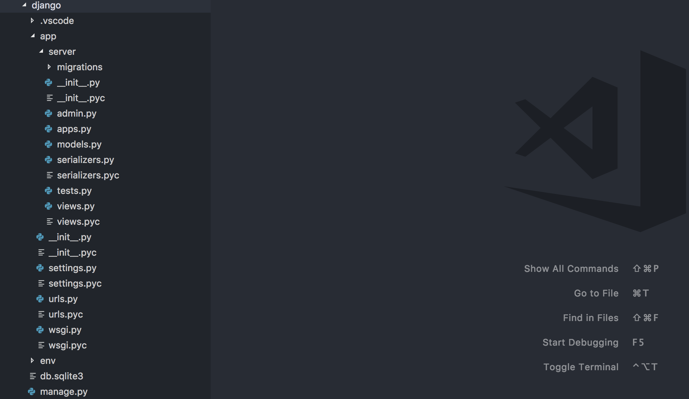
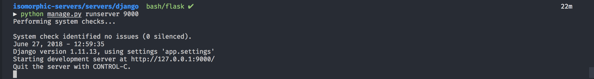

# Django JWT


In the root folder you will get a folder named servers in the servers folder you will get a folder named django . The structure of the folder is below



To start the server run the below command

```
python manage.py runserver 9000
```



All the routes are in `app->urls.py file`. You will get below routes in this file

``` python
# Auth Route
    url(r'^api/secret/test', include(router.urls)),
    # No Authertication required
    url(r'^api/login', obtain_jwt_token),
    url(r'^api/refresh', refresh_jwt_token),
    url(r'^api/verify', verify_jwt_token),
```

We have given a user model you test it. Just check the `app->server->serializer.py` and the views `app->server->views.py`

`serializers.py` User Serializer below

```python
class UserSerializer(serializers.HyperlinkedModelSerializer):
    class Meta:
        model = User
        fields = ('url', 'username', 'email')
```

User Views we Have used Django default viewset `app->server->views.py`

```python
class UserViewSet(viewsets.ModelViewSet):
    """
    API endpoint that allows users to be viewed or edited.
    """
    queryset = User.objects.all().order_by('-date_joined')
    serializer_class = UserSerializer
```


Modify all of these to your need.

#### Important Notice:

For testing django server you need to change a few code as we have tested the server for GET method. So in the root directory

`isomorphic-servers/src/helpers/authHelper.js` Replace the below code

```js
return await SuperFetch.post('secret/test', { token })
```

With below code,

```js
return await SuperFetch.get('secret/test', { token })
```

Here post has been replaced with get .

Another important thing is understanding the below settings. which resides in `isomorphic-servers/servers/django/app/settings.py` path.

Here the below settings can be changed on your need

```py
JWT_AUTH = {
    'JWT_ENCODE_HANDLER':
    'rest_framework_jwt.utils.jwt_encode_handler',

    'JWT_DECODE_HANDLER':
    'rest_framework_jwt.utils.jwt_decode_handler',

    'JWT_PAYLOAD_HANDLER':
    'rest_framework_jwt.utils.jwt_payload_handler',

    'JWT_PAYLOAD_GET_USER_ID_HANDLER':
    'rest_framework_jwt.utils.jwt_get_user_id_from_payload_handler',

    'JWT_RESPONSE_PAYLOAD_HANDLER':
    'rest_framework_jwt.utils.jwt_response_payload_handler',

    'JWT_SECRET_KEY': 'secretKey',
    'JWT_GET_USER_SECRET_KEY': None,
    'JWT_PUBLIC_KEY': None,
    'JWT_PRIVATE_KEY': None,
    'JWT_ALGORITHM': 'HS256',
    'JWT_VERIFY': True,
    'JWT_VERIFY_EXPIRATION': True,
    'JWT_LEEWAY': 0,
    # 'JWT_EXPIRATION_DELTA': datetime.timedelta(seconds=300),
    'JWT_AUDIENCE': None,
    'JWT_ISSUER': None,

    'JWT_ALLOW_REFRESH': False,
    # 'JWT_REFRESH_EXPIRATION_DELTA': datetime.timedelta(days=7),

    'JWT_AUTH_HEADER_PREFIX': 'Bearer',
    'JWT_AUTH_COOKIE': None,

}
```

Here `JWT_SECRET_KEY` is the most important part. You have to use same secret key for both frontend and back end. The frontend config can be found in path `isomorphic-servers/src/settings/index.js` under below config

```js
const jwtConfig = {
  fetchUrl: '/api/',
  secretKey: 'secretKey',
};
```

