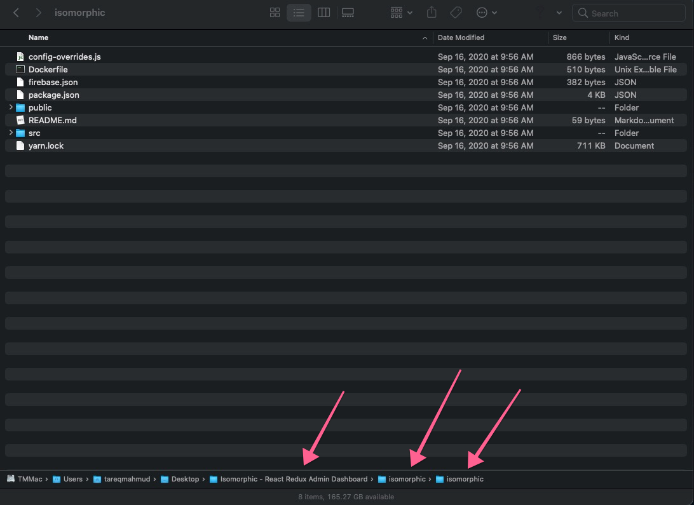

## Installation

### Make sure you follow these steps before proceeding to installation

1. Download Isomorphic - React Redux Admin Dashboard from themeforest.
2. Uncompress the zip file
3. Go to Isomorphic - React Redux Admin Dashboard -> Isomorphic directory
4. Follow the below installation instruction guideline

## Installation Step
* Install Node JS
* Install yarn
* yarn
* yarn start:iso-cra


## Installing Node:

To work with Isomorphic the first thing you need is to have [Node](https://nodejs.org/) install on your
system. To make sure you have already Node js installed on your system you may
follow the below instructions :-

As Node will make sure you have node and npm commands are available via
command line, just run the below command on your terminal

```
node -v
```

## Installing YARN:
You will need to Install [Yarn](https://yarnpkg.com/) for the Fast, Reliable, and Secure Dependency
Management. Before you start using [Yarn](https://yarnpkg.com/), you'll first need to install it on your
system. And to make sure it running on your system with latest version run the
below command

```
yarn -version

or

yarn -v
```

On successful installation, it will print out the version.


## Installing Packages & Dependencies:
After Installing Yarn, now open the `Isomorphic` app in your terminal. Now at your terminal In the root directory of `Isomorphic` app just run

```
yarn
```

it will download all the necessary packages and dependencies in the
node_modules folder


## yarn start:iso-cra

Now	to start the `Isomorphic` app all you need to do is	to	run	the	below
command	in	you	terminal	root	directory	of	the	 	`Isomorphic`		app.

```
yarn start:iso-cra
```

after	the	compiled	process	completed	successfully,	it	will	show	the	below	success
commands	&	redirect	to	the	 	[http://localhost:3002/](http://localhost:3002/)		of	your	browser	where
you	will	find	the	login	screen	of	the	 	Isomorphic		app.

*** NOTE:	The	above	installation	guide	uses	our
monorepo	structure ***

## Non	Monorepo:

#### React	App	(using	Create	React	App)

If	you	want	to	use	a	non	monorepo	dashboard	then	you	can	directly	go	to	the
isomorphic	directory



and	run	the	below	command,

1. yarn
2. yarn	start
3. yarn	build

the non monorepo dashboard is bootstrapped with Create React App

### Next Js App
if you want to use non monorepo for Isomorphic Next you need to put everything from shared directory to the root of your next js app and add the below alising to your next.config.js file

```
module.exports = {
  webpack(config, options) {
  config.resolve.alias = {
      ...config.resolve.alias,
            '@iso/assets': path.join(__dirname, 'assets'),
        '@iso/components': path.join(__dirname, 'components'),
        '@iso/config': path.join(__dirname, 'config'),
        '@iso/containers': path.join(__dirname, 'containers'),
        '@iso/redux': path.join(__dirname, 'redux'),
        '@iso/lib': path.join(__dirname, 'library'),
        '@iso/ui': path.join(__dirname, 'UI'),
    return config
  },
}
```
that's it