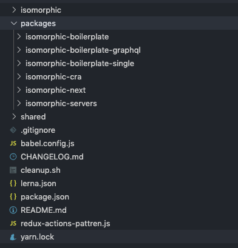
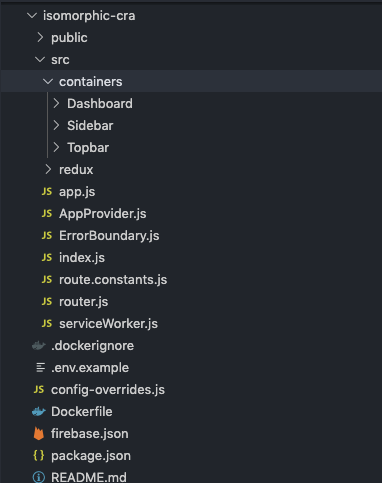
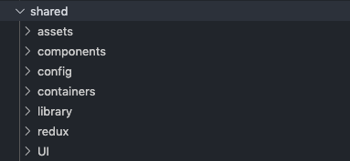
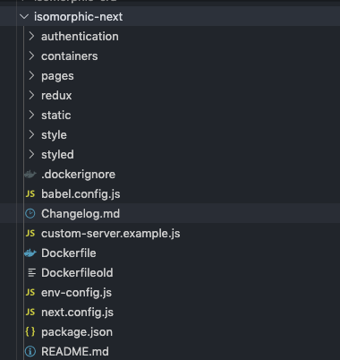
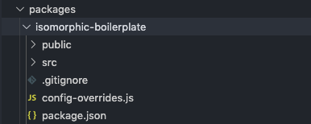
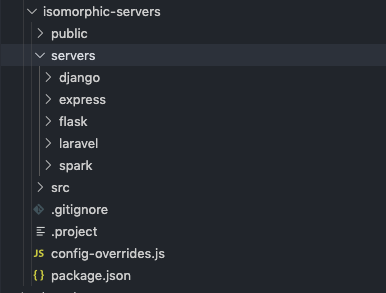
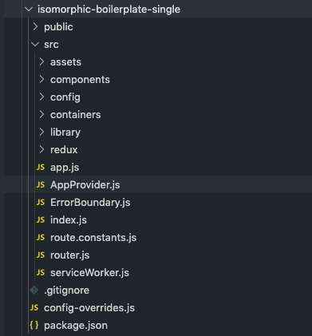
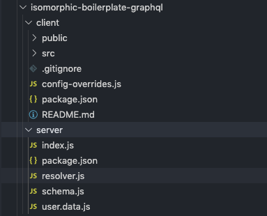

# Monorepo Packages Overview

This section will help you to understand the folder structures monorepo package. Inside the Root Isomorphic directory there you will see a packages directory where you will find the below packages

1. isomorphic-cra
2. isomorphic-next
3. isomorphic-boilerplate
4. isomorphic-boilerplate-graphql
5. isomorphic-boilerplate-single
6. isomorphic-servers

Lets go to the next section to find out details about them.

## isomorphic-cra

isomorphic-cra is bootstrapped create react app. You can see the isomorphic-cra directory from the below screenshot,

and most of the components of isomorphic cra is coming from the shared directory,

please note that shared is also another monorepo package.

## isomorphic-next

isomorphic next is bootstrapped with next js and in below screenshot you can see the folder structure,

## isomorphic-boilerplate

if Anyone want to use with monorepo and custom CRA

## Isomorphic-servers.zip

Some server side integration is provided in Isomorphic. Three server side support is already integrated like Laravel, Spark, express. We have some upcoming features in the queue also.

## isomorphic-boilerplate-single
If Anyone want to use isomorphic boilerplate without monorepo,

## Isomorphic-boilerplate-graphql
CRA with GraphQL server and client

