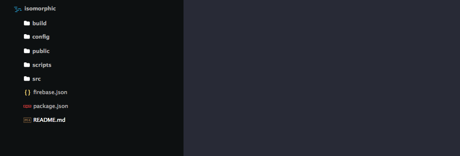
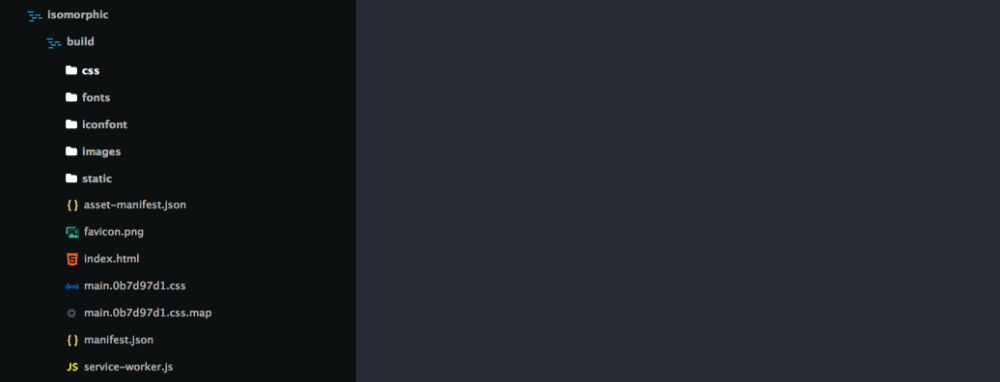
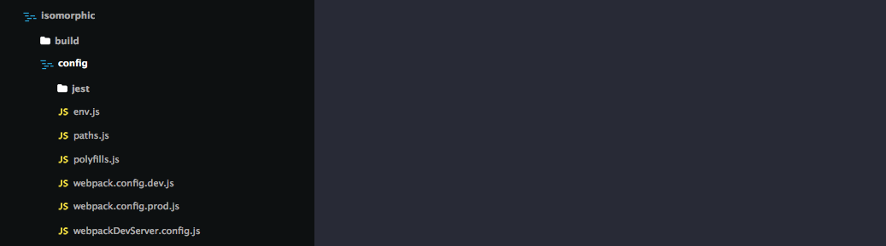
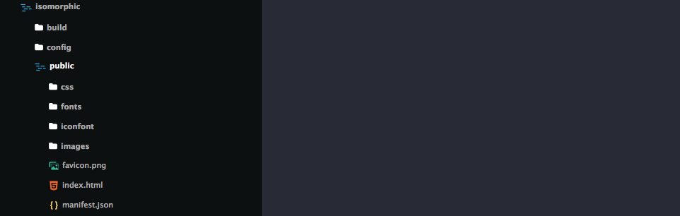
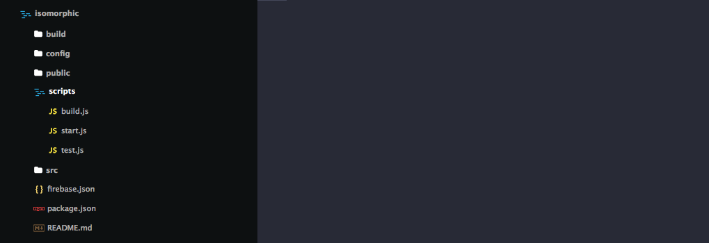
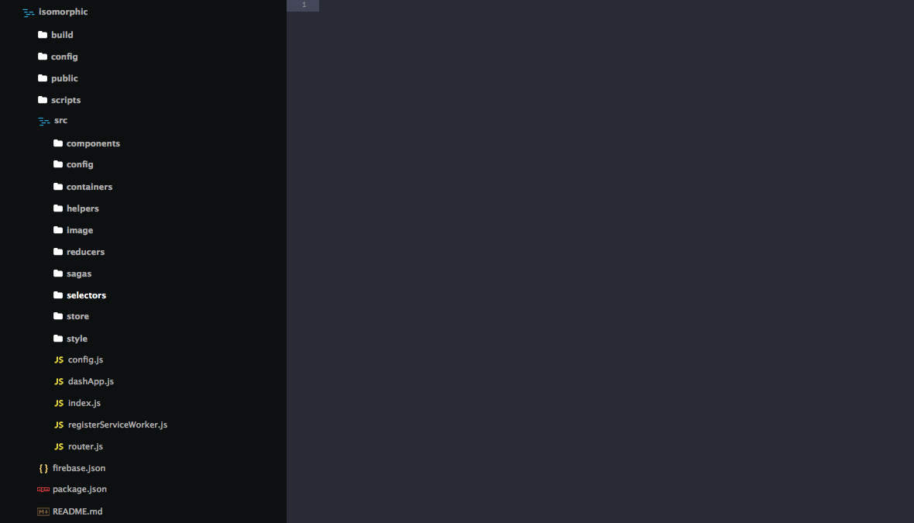

# Non Monorepo Structure:

NOTE: please note that currently we are providing non monorepo only for the Create React App Dashboard and not for other packages.

After downloading Isomorphic from themeforest, you will find a zip. If you extract this, there is a Isomorphic folder for you which contains all of our codes. inside isomorphic directory there is another isomorphic directory which is basically a non monorepo version and bootstraped with Create React App.

The folder structure of Isomorphic is following like that.

**Build:** All the Build files are available on this folder.

config: It contains all the files regarding webpack. All the build configurations (develop, production) is inside that folder.

**node_modules:** It contains all the npm packages that is used on this projects.

**public:** Contains public files used on the projects like menifest file, index.html file, icon files.

**scripts:** Contains files that fires up the build file on the config for the node environment.

**src:** Contains all the codes including js, less and the image files. It has some folders inside. They are:

* components: Reusable react components
* containers: Constains all the files of the react component of the project.
* config: General config files.
* helpers: Utility codes for the projects.
* image: Images used in the project.
* reducers: Contains the functional code of redux.
* sagas: React sagas for handling async request.
* selectors: React selectors
* store: Redux Stores
* styles: Less code files.

**package.json:** Contains all the informations about the project like third party packages, scripts etc .

**server.js:** The file fires up the node server.