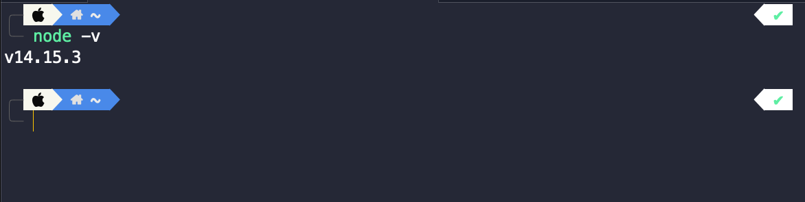
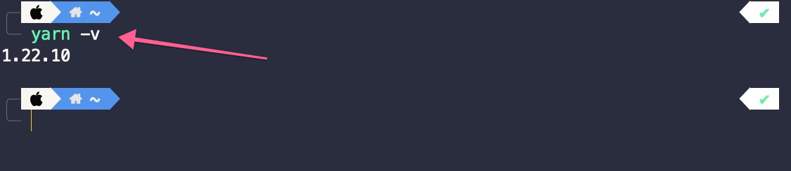

# Pre Installation

For development and build isomorphic, Some tools are required. Such as,

- Node
- Yarn

Follow this documentation section to install those tools.

## Installation Step
* Install Node JS
* Install yarn
* yarn
* yarn start:iso-cra


## Installing Node:

To work with Isomorphic the first thing you need is to have [Node](https://nodejs.org/) install on your
system. To make sure you have already Node js installed on your system you may
follow the below instructions :-

As Node will make sure you have node and npm commands are available via
command line, just run the below command on your terminal

```
node -v
```

On successful installation, it will print out the version.



## Installing YARN:
You will need to Install [Yarn](https://yarnpkg.com/) for the Fast, Reliable, and Secure Dependency
Management. Before you start using [Yarn](https://yarnpkg.com/), you'll first need to install it on your
system. And to make sure it running on your system with latest version run the
below command

```
yarn -version

or

yarn -v
```

On successful installation, it will print out the version.

