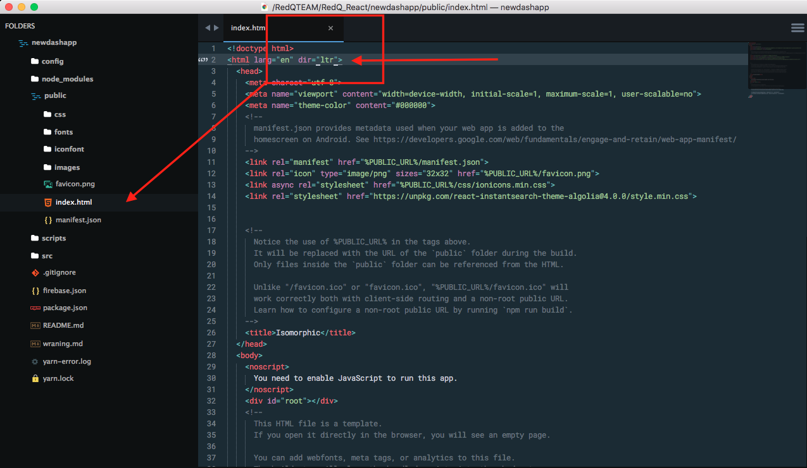

# LTR -> RTL (css) transformation

Isomorphic supports ***LTR*** (left to right) view to ***RTL*** (right to left) transformation.

The transformation process is very easy to use.

Here is the dashboard overview in ***LTR*** mood :

To transform dashboard into ***RTL*** view the process is :

1. Go to public folder
2. index.html file
3. change the `dir="ltr" to dir="rtl"` (please see the screenshot)

